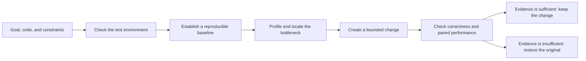

  <picture>
    <source media="(prefers-color-scheme: dark)" srcset="asset/logo-wordmark-dark.svg">
    
  </picture>

<strong>Evidence-driven CUDA, CUTLASS and Triton optimization for Codex</strong>

  <a href="docs/getting-started.md">Get Started</a> ·
  <a href="docs/workflows.md">Workflows</a> ·
  <a href="docs/evidence-and-safety.md">Evidence &amp; Safety</a> ·
  <a href="skills/cuda-kernel-optimizer/examples/walkthrough.md">Examples</a> ·
  <a href="README.zh-CN.md">简体中文</a>

## About

`cuda-kernel-optimizer` is a reusable Codex skill for improving CUDA, CUTLASS,
and Triton code. It can optimize one kernel, diagnose a complete GPU workload,
validate a kernel change against a serving objective, or analyze an existing
Nsight Compute report without launching the original program.

It combines environment checks, profiling, bounded code changes, correctness
validation, and paired performance measurements in one resumable workflow. It
does not assume that every bottleneck is on the GPU: framework scheduling, CPU
work, transfers, communication, I/O, and runtime conditions are part of the
diagnosis when the user supplies a complete workload.

The skill may modify only declared project paths and isolated project
environments. It never changes host-level settings automatically; drivers,
permissions, clocks, power limits, and system configuration remain advisory.

## Quick start

Installation is performed by Codex. Ask Codex to install or update the skill
from [troycheng/cuda-optimized-skill](https://github.com/troycheng/cuda-optimized-skill)
at `skills/cuda-kernel-optimizer`, then start a new session so the instructions
are reloaded.

Provide a runnable target, a correctness reference, the test environment, a
performance goal, constraints, and the allowed modification scope.
A real workload must be supplied by the user; the skill does not download or invent one.

Choose `quick` for a 45-minute search, `balanced` for the default three-hour
budget, or `thorough` for up to ten hours of broader exploration.

> Use cuda-kernel-optimizer to optimize the Triton kernel in this directory. Verify the reference and inputs first, keep host settings unchanged, and retain a change only when correctness and paired performance evidence pass.

See [Getting Started](docs/getting-started.md) for the input checklist and first
run boundaries.

## Choose a workflow

| Workflow | Use it when | Result boundary |
|---|---|---|
| **Kernel optimization** | A CUDA, CUTLASS, or Triton implementation has a comparable reference | A kernel-level result with correctness, compiler/profiler evidence, paired samples, and a confidence result |
| **Complete workload** | Latency, throughput, or cost is off target and the bottleneck is unknown | A diagnosis across kernel, framework, CPU, transfer, communication, I/O, and environment paths, followed by a bounded end-to-end evaluation |
| **Serving validation** | A kernel benchmark improved and the product KPI must be checked | Frozen c1/c2/c4/c8/c12 strata, serving-stack identity, per-stratum constraints, and a separate performance and evidence-integrity decision |
| **Existing NCU report** | A `.ncu-rep` already exists and the profiled workload must not run again | Read-only report analysis; importing a report does not prove current counter access or current target identity |

[Workflows](docs/workflows.md) explains required inputs, allowed changes, and the
claim each path can support.

## How it works

Before the first candidate, the workflow freezes the baseline, environment, and
prevalidated measurement paths. It first checks whether the direction's measured
ceiling can still justify another round and records stop or reopen decisions in
an append-only ledger. Comparable directions are ranked only within the same
claim layer; other comparisons remain explicit rather than receiving invented weights.
See the [direction-admission contract](skills/cuda-kernel-optimizer/references/direction_admission.md).

Each admitted round starts with a falsifiable performance
hypothesis, and only a rehashed V2.5 evidence closure counts as an evaluated
candidate. Measurement tooling has a hard time and repair limit; after that,
the AI switches to a different frozen path or stops the direction. Tool work is
not a performance improvement and is not reported as one. The detailed rules are in the
[performance-first iteration contract](skills/cuda-kernel-optimizer/references/performance_iteration.md).

The workflow freezes the objective and authorized scope before timed work. Each
candidate is tied to its source, binary, inputs, schedule, raw rows, and runtime
identity. A rejected or interrupted candidate is recorded without overwriting a
previously valid result.

## Evidence, not best-sample claims

A performance claim is accepted only when the evidence closes:

- correctness and every declared constraint pass;
- paired A/B samples use the frozen schedule and aggregation rule;
- the default 95% confidence interval supports the required relative and
  absolute gain, with enough valid pairs;
- the continuous shared-host guard covers the timed phase without unknown,
  missing, stale, or contaminated samples;
- formal serving runs cover every c1/c2/c4/c8/c12 stratum and bind the timed
  binary to the proved execution path.

Formal uncertainty, missing required evidence, identity drift, or contamination
must fail closed. Timed work cannot be rescued by excluding inconvenient rows or
retrying only one role after the frozen experiment begins.

`performance_verdict` and `evidence_integrity` are separate decisions: a fast
number cannot compensate for an invalid attempt. The installed `self_check` is
CPU/static only and does not validate a GPU environment. See
[Evidence & Safety](docs/evidence-and-safety.md) for the claim ladder and host
boundaries.

## Tested scope

The following figures are historical acceptance evidence, not a promise that
unrelated projects will achieve the same speedup. No GPU result is inferred from
the CPU/static checks in this documentation change.

| Validation lane | Recorded result | Interpretation |
|---|---|---|
| CPU/static acceptance | 788 tests: 783 passed, five RTX 5090 opt-in tests skipped, zero failed | Exercises state recovery, evidence binding, shared-host guards, timeouts, restoration, and input validation |
| Physical RTX 5090 lane | 13/13 checks in 34.302 seconds; target-side NCU returned `ERR_NVGPUCTRPERM` | The GPU workflow ran without changing privilege or driver policy |
| Reproducible workload fixture | End-to-end latency improved 60.4616% with constraints passing | Demonstrates the workflow on that fixture only |
| User-supplied vLLM workload | Kernel metric improved 26.3287%; real workload changed -0.0097% | The original was kept because a faster kernel did not improve the product workload |
| Imported NCU report | Parsed 140 metrics without launching the profiled program | Does not establish current counter permissions or current runtime identity |

Detailed versions and opt-in conditions are in
[Compatibility](docs/compatibility.md). Historical speedups are not general
performance guarantees.

## Release notes

The maintained release history starts with V2.2. These notes describe project
versions; they do not imply that every historical version has a matching Git tag.

### V2.7

Added direction-level admission, conservative impact ceilings, and an append-only stop/reopen ledger. AI agents now decide whether a direction is still worth a candidate round before spending V2.6 budget.

### V2.6

Added the performance-first iteration gate: frozen hypotheses, bounded tool repair, prevalidated fallbacks, and machine-readable round outcomes that cannot turn infrastructure work into a speedup claim.

### V2.5

Added formal evidence automation for shared hosts and serving runs: frozen designs, continuous guards, artifact and execution-path identity, sealed attempts, audit, and separate performance and integrity decisions.

### V2.4

Added the complete workload controller, deterministic bottleneck diagnosis, bounded ChangeSets, advisory review, and the recommend-only boundary for host changes.

### V2.3

Expanded portable CUDA, CUTLASS, Triton, native and legacy coverage; added read-only NCU report analysis, strategy memory, and clearer systems, IR, and serving guidance.

### V2.2

Established the dual-loop optimizer: paired kernel measurements, user-supplied workload validation, resumable checkpoints, sanitizer and compiler evidence, separate kernel/end-to-end conclusions, and the RTX 5090 test lane.

## Documentation

- [Getting Started](docs/getting-started.md)
- [Workflow selection](docs/workflows.md)
- [Evidence and safety](docs/evidence-and-safety.md)
- [Compatibility](docs/compatibility.md)
- [Agent execution protocol](skills/cuda-kernel-optimizer/SKILL.md)
- [Kernel and workload walkthrough](skills/cuda-kernel-optimizer/examples/walkthrough.md)
- [Performance-first iteration contract](skills/cuda-kernel-optimizer/references/performance_iteration.md)
- [Direction-admission contract](skills/cuda-kernel-optimizer/references/direction_admission.md)
- [Formal V2.5 evidence reference](skills/cuda-kernel-optimizer/references/evidence_automation.md)
- [Canonical compatibility reference](skills/cuda-kernel-optimizer/references/compatibility.md)
- [RTX 5090 opt-in test guide](tests/gpu/sm120/README.md)
- [MIT License](LICENSE)

This project is independent of CUDA, CUTLASS, Triton, and Nsight Compute. Use
those dependencies under their respective licenses.
