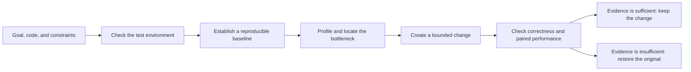

# cuda-kernel-optimizer

**English** | [简体中文](README.zh-CN.md)

`cuda-kernel-optimizer` is a CUDA performance optimization project for Codex,
packaged as a reusable skill. It can optimize one CUDA, CUTLASS, or Triton
kernel, or analyze and improve a complete GPU workload supplied by the user.

Given runnable code, a test environment, and a performance goal, the AI handles
environment checks, profiling, bottleneck analysis, code changes, and paired A/B
tests. A change is kept only when it remains correct, meets the performance
target, and satisfies every declared constraint.

The project may change authorized kernels, runtime parameters, and project code.
For drivers, permissions, clock settings, power limits, and other host-level
settings, it provides recommendations that are never applied automatically.

## What this project is

This is an AI-operated performance optimization workflow. It connects environment
checks, a reproducible baseline, profiling, candidate changes, correctness checks,
and performance evaluation in one resumable process. The evidence behind each
decision is saved for later review.

The workflow does not assume that every bottleneck is inside a kernel. For a
complete GPU workload, it can also examine framework scheduling, CPU data
processing, host-to-device transfers, multi-GPU communication, I/O, and the
runtime environment. When the evidence points to the host, the result contains
host recommendations instead of changing the machine.

## Problems it can solve

| Task | When to use it | What the AI does | Main result |
|---|---|---|---|
| **Optimize one kernel** | You have a CUDA, CUTLASS, or Triton implementation and a comparable reference | Check correctness, inspect compiler and profiling data, iterate on the implementation, and run paired performance tests | Modified kernel code with a reproducible performance result |
| **Optimize a complete GPU workload** | Latency, throughput, or cost is off target, but the bottleneck is not yet known | Run the workload, distinguish kernel, framework, CPU, transfer, communication, I/O, and environment limits, then change authorized code or parameters | Bottleneck analysis, a bounded change, and an end-to-end result |
| **Validate an optimization on a real workload** | A kernel benchmark improved and you need to know whether the product metric also improves | Compare the original and changed implementation on user-supplied real inputs while checking accuracy, memory, output, and other constraints | An end-to-end result that can be adopted, or a clear reason to keep the original |
| **Analyze an existing NCU report** | You already have a `.ncu-rep` and do not want to launch the profiled program again | Read the report and summarize hot kernels, important metrics, and likely limiting factors | A standalone NCU analysis without launching a new GPU workload |

## What you need to provide

Reliable conclusions depend on inputs that represent the real objective. A task
normally needs:

- **A runnable target:** a baseline kernel, a complete workload, or an existing
  NCU report;
- **A correctness standard:** a Python reference, test cases, a validation
  function, or comparable output;
- **A test environment:** the target GPU, driver, and dependencies, or permission
  to install project dependencies in an isolated environment;
- **A performance goal:** latency, throughput, memory use, cost, or another KPI;
- **Constraints:** accuracy, output consistency, memory limits, files that may be
  changed, and settings that must remain untouched;
- **A compute budget:** the allowed runtime and search scale.

A real workload must be supplied by the user. The project does not download,
invent, or replace it with a microbenchmark. With only a kernel and reference,
the workflow can establish a kernel-level result, but it cannot claim an
end-to-end improvement.

`balanced` is the default when the user does not choose a budget.

| Budget | Maximum time | Best suited for |
|---|---:|---|
| `quick` | 45 minutes | Checking an idea and narrowing the candidate set |
| `balanced` | 3 hours | The default balance between search coverage and runtime |
| `thorough` | 10 hours | More candidates, deeper profiling, and broader validation |

These are upper limits, not fixed runtimes. A task may finish early once it has
a clear result, no viable candidates remain, or the available evidence is
insufficient.

## How the AI works

The AI first confirms the objective and allowed modification scope, then checks
the environment and inputs. Profiling and candidate changes begin only after the
baseline can be reproduced. Each change is bound to declared files and compared
with the original under the same conditions. If the task is interrupted, it can
resume from a saved checkpoint without repeating completed stages whose inputs
have not changed.

An external model may be used as an optional reviewer for the analysis and
change rationale. The reviewer is advisory. Local correctness and performance
evidence still determine whether a change is kept.

## How results are accepted

The project uses paired A/B measurements to compare the original and changed
implementation. Both variants run repeatedly on the same inputs in an
interleaved order, reducing bias from machine noise, cache state, and run order.

A change must satisfy all of the following:

1. **Correctness passes:** output agrees with the reference or workload validation;
2. **The gain meets the threshold:** the result is not based on one unusually fast run;
3. **Statistical evidence supports the result:** a 95% confidence interval is checked by default;
4. **Every constraint passes:** accuracy, memory, checksums, and product metrics remain within bounds;
5. **The test target has not drifted:** inputs, code identity, and environment definition stay fixed during comparison.

If performance regresses, the confidence interval cannot confirm a gain,
correctness fails, or any constraint is violated, the workflow will restore the
original implementation and record where the candidate failed. Missing optional
evidence, such as NCU counter access, is reported as degraded coverage and is
never presented as a successful measurement.

For a V2.5 formal serving result, the attempt can be sealed as `valid` only when
the continuous shared-host guard and frozen c1/c2/c4/c8/c12 serving strata pass
their validators. The result records `evidence_integrity` separately from the performance verdict.
The installed `self_check` is CPU/static only and does not claim a new GPU validation.

## What you receive

A completed task delivers:

- **Verified changes:** the modified code, limited to work that passed validation
  within the authorized scope;
- **Bottleneck analysis:** whether the limiting factor is in the kernel,
  framework, CPU, transfer, communication, I/O, or environment;
- **Performance comparison:** baseline and candidate results, paired samples,
  improvement percentage, and confidence interval;
- **Correctness and constraint results:** a pass or fail result for every check;
- **Rejected attempts:** which ideas failed, regressed, or lacked enough evidence;
- **Host recommendations:** evidence-backed suggestions when drivers,
  permissions, clocks, or system settings need attention;
- **A resumable record:** saved task state and key evidence for later review.

If no reliable improvement is found, the result states that the original was
kept. It does not select the fastest isolated sample when the evidence is weak.

## Modification scope and safety limits

| Scope | What the AI may do | Limit |
|---|---|---|
| Project code | Modify explicitly authorized kernels, calling code, and runtime parameters | The actual diff must stay within the declared scope |
| Isolated environment | Install or adjust project dependencies in a user-provided isolated environment | It must remain separate from the project source and host system directories |
| Host configuration | Collect information and provide recommendations | Drivers, permissions, clocks, power limits, and system settings are never changed automatically |
| Third-party reviewer | Receive an analysis summary and return review comments | It cannot run callback commands or decide whether a change is kept |

Changes outside the authorized paths, workload drift, an expired budget, or a
failed validation stop the current candidate. If restoration itself fails, the
task is marked for manual recovery instead of continuing to overwrite the
working state.

## Usage examples

> Optimize the Triton kernel in this directory for an RTX 5090. Confirm the reference and test inputs first, then profile the bottleneck. Keep a change only if correctness and paired performance both pass.

> Analyze the latency bottleneck in this GPU workload. The test environment is ready, and project code and runtime parameters may be changed. For host-level settings, provide recommendations only.

> Analyze this NCU report and identify the kernels and limiting factors worth addressing first. Do not rerun the original workload or change driver and counter permissions.

> Use the balanced budget to validate this CUDA optimization on the real workload. The primary metric is p95 latency, and GPU memory use must not increase by more than 5%.

## Tested environments and compatibility

The project has been accepted through CPU tests and runs on physical RTX 5090
hardware. These figures show which workflow paths have been tested; they are not
a promise that unrelated projects will see the same speedup.

| Validation | Environment and result | What it demonstrates |
|---|---|---|
| Automated tests | 745 total; 740 passed, five RTX 5090 opt-in tests skipped outside a GPU environment, zero failed | State recovery, evidence binding, shared-host guard, timeouts, restoration, and input validation |
| Full RTX 5090 run | The current test environment passed 13/13 checks in 34.302 seconds; target-side NCU profiling returned `ERR_NVGPUCTRPERM` | CUDA, CUTLASS, Triton, and the complete GPU workload optimization flow; no privilege or driver policy was changed |
| Reproducible workload fixture | End-to-end latency improved 60.4616%, with constraints passing | The full path from bottleneck analysis to keeping a verified change |
| User-supplied vLLM workload | The kernel metric improved 26.3287%, while the real workload changed -0.0097% | End-to-end evidence was insufficient, so the original was kept; a faster kernel does not guarantee a faster product workload |
| Existing NCU report | Parsed 140 metrics without launching the original program | Counter access was not reprobed; importing a report does not establish whether the current target can read performance counters |

Kernel optimization requires Python 3.10+, a working CUDA GPU and driver, and
the relevant toolchain. Triton tasks need `triton`; CUDA and CUTLASS compilation
needs `nvcc` and CUTLASS headers; SASS analysis uses `cuobjdump`. NCU profiling
is optional and is reported as unavailable or degraded when it cannot run.

Standalone NCU report analysis only needs a compatible `ncu` and the report
file. It does not launch the profiled program. The project does not redistribute
CUDA, CUTLASS, Triton, or Nsight Compute.

See the [compatibility notes](skills/cuda-kernel-optimizer/references/compatibility.md)
and [RTX 5090 test guide](tests/gpu/sm120/README.md) for detailed versions,
architecture routing, and opt-in tests.

## Installation and further documentation

Installation is performed by Codex. Give Codex the
[GitHub repository](https://github.com/troycheng/cuda-optimized-skill) and the
skill path `skills/cuda-kernel-optimizer`, then ask it to install or update the
skill. Start a new session afterward so Codex reloads the skill instructions.
The internal read-only mirror is available on
[GitLab](https://git.yukework.com/mlsys/cuda-optimized-skill).

Further documentation:

- [AI execution protocol](skills/cuda-kernel-optimizer/SKILL.md)
- [Complete workload controller example](skills/cuda-kernel-optimizer/examples/workload-controller.md)
- [Kernel optimization walkthrough](skills/cuda-kernel-optimizer/examples/walkthrough.md)
- [Optimization catalog](skills/cuda-kernel-optimizer/references/optimization_catalog.md)
- [Compatibility notes](skills/cuda-kernel-optimizer/references/compatibility.md)
- [V2.5 evidence automation](skills/cuda-kernel-optimizer/references/evidence_automation.md)
- [V2.5 migration notes](skills/cuda-kernel-optimizer/references/migration_v2_5.md)
- [RTX 5090 test guide](tests/gpu/sm120/README.md)
- [MIT License](LICENSE)

This project is independent of CUTLASS, Triton, and Nsight Compute. Install and
use those dependencies under their respective licenses.
