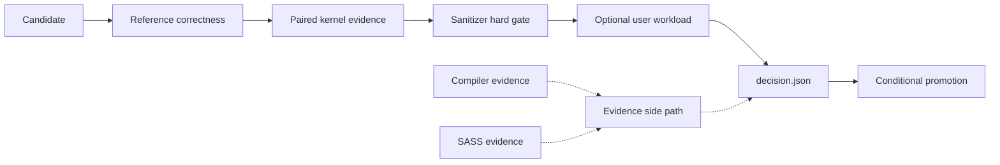
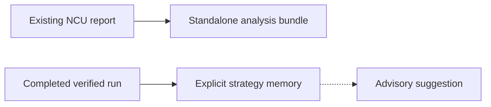

# cuda-kernel-optimizer

**English** | [简体中文](README.zh-CN.md)

A Codex skill for optimizing CUDA, CUTLASS, and Triton kernels with durable
correctness, paired-performance, sanitizer, profiler, SASS, and real-workload
evidence. V2.2 uses a dual-loop workflow: the inner loop establishes a kernel
result; the optional outer loop checks it against a workload owned by the user.

## Start by task

- **Optimize a kernel** — run the controlled candidate loop from a baseline and
  Python reference.
- **Validate a real workload** — add an explicit workload and objective when an
  end-to-end claim matters.
- **Analyze an existing NCU report** — import a `.ncu-rep` without launching its
  target.
- **Use explicit advisory memory** — record a completed run and request scoped
  search hints. This never changes a run or promotion decision.

## Install

```bash
python3 "${CODEX_HOME:-$HOME/.codex}/skills/.system/skill-installer/scripts/install-skill-from-github.py" \
  --repo troycheng/cuda-optimized-skill \
  --ref main \
  --path skills/cuda-kernel-optimizer

cd "${CODEX_HOME:-$HOME/.codex}/skills/cuda-kernel-optimizer"
```

The installer does not overwrite an existing directory. Move the old copy
before reinstalling, then start a new Codex session. Repository contributors can
instead `cd skills/cuda-kernel-optimizer`; the commands below stay the same.

## Five-minute first run

```bash
python3 scripts/orchestrate.py setup \
  --baseline /path/to/gemm.cu \
  --ref /path/to/ref.py \
  --dims '{"M":4096,"N":4096,"K":4096}' \
  --budget balanced

python3 scripts/orchestrate.py open-iter \
  --run-dir /path/to/run_YYYYMMDD_HHMMSS --iter 1

python3 scripts/orchestrate.py close-iter \
  --run-dir /path/to/run_YYYYMMDD_HHMMSS --iter 1

python3 scripts/orchestrate.py finalize \
  --run-dir /path/to/run_YYYYMMDD_HHMMSS
```

`setup` validates and freezes inputs, seeds the baseline, and writes the first
checkpoint. It does not profile the current best or create branch directories.
`open-iter` admits work within the frozen budget. `close-iter` evaluates the
candidates. Finalize only after the decision stage is complete.

## Trusted promotion path



Solid edges are authoritative flow. Correctness, paired A/B evidence, and the
sanitizer gate determine eligibility. Compiler provenance and SASS document the
implementation but are not hard promotion gates. Only `decision.json` can
advance a candidate.

`kernel_only_win` confirms only the kernel result. Without a workload it is the
normal successful terminal result; it may also be the terminal outcome in full mode
after workload failure/loss/inconclusive evidence. It never advances the
global best in full mode. `end_to_end_win` requires a confirmed kernel win, a
confirmed primary-KPI win, and every constraint passing. It is the only
full-mode result that advances the global best.

## Task commands

### Optimize a kernel

Start with the first-run commands above. For later rounds, increment `--iter` and
follow `checkpoint.json`. Read the method catalog and available profiler
evidence before writing each budgeted branch.

### Validate a real workload

```bash
python3 scripts/orchestrate.py setup \
  --baseline /path/to/gemm.cu \
  --ref /path/to/ref.py \
  --dims '{"M":4096,"N":4096,"K":4096}' \
  --budget balanced \
  --workload /path/to/workload.py
```

The user supplies the workload. The skill does not discover, download, or
invent one. `--workload-cmd ... --objective ...` and `--workload-manifest ...`
are the other supported input forms.

### Analyze an existing NCU report

```bash
python3 scripts/analyze_ncu_rep.py REPORT \
  --source SOURCE \
  --out-dir OUTPUT \
  --ncu-bin NCU \
  --ncu-num 5 \
  --timeout 120
```

Only `REPORT` and `--out-dir` are required. The analyzer reads the report; it
does not execute the profiled target.

### Use explicit advisory memory

```bash
python3 scripts/strategy_memory.py record \
  --memory MEMORY --run-dir RUN_DIR --out OUT

python3 scripts/strategy_memory.py suggest \
  --memory MEMORY --manifest MANIFEST --out OUT
```

`--memory` is always explicit. There is no orchestrator default and no implicit
reuse across projects.

## Standalone tool boundaries



The report analyzer writes `analysis.json` last as the completion marker. Its
bundle records `counter_access: not_probed`; importing a report does not prove
current counter permission, source execution, or end-to-end behavior. A partial
bundle exits 2 and names the unavailable component. A hard failure does not
publish a fresh completion marker.

Strategy memory accepts only a completed, strictly verified V2.2 run in the
exact manifest scope. Suggestions are detached search hints. They cannot remove
branches, change profiler or budget policy, overwrite evidence, or connect to
`decision.json` and promotion.

## Inputs, budgets, and statuses

### Inputs

Every optimization run needs a baseline `.cu` or Triton `.py` kernel, a Python
reference exposing `reference(**kwargs)`, and JSON dimensions. A real workload
is optional, but required for an `end_to_end_win` claim.

Choose exactly one workload form:

- `--workload ./workload.py` for a Python adapter;
- `--workload-cmd 'command ...' --objective ./objective.json` for an argv command;
- `--workload-manifest ./workload.json` for a strict manifest.

```json
{
  "kind": "python",
  "source": "./workload.py",
  "objective": {
    "primary_metric": {"name": "p50_latency_ms", "direction": "lower"},
    "min_effect_pct": 1.0,
    "constraints": []
  },
  "cases": [{}]
}
```

The manifest requires `kind`, `source`, and `cases`. Use one objective source:
embedded objective or --objective, never both. For a Python manifest, the selected objective must
match the adapter's `metrics()` contract.

### Compute budgets

`balanced` is the default when the user does not select a preset.

| Preset | Max seconds | Branches | Max rounds | Min pairs | Max pairs | Outer candidates | Max cases | Sanitizer |
|---|---:|---:|---:|---:|---:|---:|---:|---|
| `quick` | 2700 | 4 | 2 | 20 | 50 | 1 | 3 | targeted |
| `balanced` (default) | 10800 | 8 | 4 | 20 | 100 | 2 | 10 | targeted |
| `thorough` | 36000 | 16 | 8 | 30 | 200 | 3 | unlimited | full |

Use `--budget custom` only with every required limit. The deadline stops new
stage admission and leaves a resumable checkpoint; partial evidence never
becomes a win.

### Terminal statuses

- `kernel_only_win`: confirmed kernel result only. In full mode it keeps the
  global best unchanged.
- `end_to_end_win`: confirmed kernel and workload result with all constraints
  passing. This is the full-mode promotion status.
- `rejected_constraint`: a workload constraint has a confirmed failure.
- loss, timeout, failure, or `inconclusive`: keep the current best.

## Artifacts and resume

```text
run_YYYYMMDD_HHMMSS/
├── manifest.json                  # frozen inputs and policy
├── state.json                     # candidate registry and history
├── checkpoint.json                # durable resume boundary
├── env.json                       # GPU and toolchain snapshot
├── workload/spec.json             # frozen workload or null
├── baseline/bench.json
├── itervN/
│   ├── branches/<candidate>/paired_samples.jsonl
│   ├── sanitizer.json
│   ├── sass_check.json
│   ├── workload/<hash>/paired_samples.jsonl
│   └── decision.json              # promotion authority
└── summary.md
```

```bash
python3 scripts/orchestrate.py resume --run-dir \
  /path/to/run_YYYYMMDD_HHMMSS
```

Resume validates frozen identities and reports the next unfinished stage. It
does not replay a completed stage. Optional profiler, sanitizer, compiler, or
workload coverage remains visibly missing or degraded in `summary.md`.

## Compatibility and verification

Runtime requirements are Python 3.10+, a CUDA GPU with a working driver, and a
CUDA-enabled `torch`. Triton kernels need `triton`; CUDA/CUTLASS kernels use
`nvcc`; SASS evidence uses `cuobjdump`. Supply CUTLASS headers with
`$CUTLASS_PATH` or `$CUTLASS_INCLUDE_DIR`. `ncu` is optional. The skill does not
redistribute CUDA, CUTLASS, Triton, or Nsight Compute.

Current CPU acceptance contains 609 tests: 605 passed, four opt-in RTX 5090
tests skipped, and zero failed. All 25/25 scripts pass `py_compile` and `--help`
smoke checks, and the skill validator reports valid.

V2.2 was validated on physical RTX 5090 hardware on 2026-07-17. The current and
compatibility containers each passed 11/11 checks. Their NCU versions were
2026.2.1 and 2025.3.1. Capability-dropped lanes returned
`ERR_NVGPUCTRPERM`; acceptance permits only that exact result or a successful
profile with real metrics. No privilege, capability, or driver policy changed.

An isolated user-provided vLLM binary workload used `balanced`: one round, two
branches, and a 10,800-second cap. Kernel paired A/B improved **26.3287%** with
a 95% CI of **[22.1801%, 30.6322%]** over 100 valid pairs. Workload
`latency_us` changed **-0.0097%**, CI **[-0.0390%, 0.0365%]**, below its 2%
effect threshold. The result was `kernel_only_win`; the global best stayed at
the baseline. The run took 2,232.43 seconds. This is binary A/B evidence, not
source-level promotion proof.

<details>
<summary>Standalone NCU report acceptance</summary>

The report analyzer was accepted separately on 2026-07-17 on a host with 8x
RTX 5090, driver 595.71.05, and NCU 2026.1.1.0. The source report was 5,966,669
bytes. Its SHA-256 was unchanged before copy, after copy, and after analysis:
`01a1356a487cc1ce77c6af541508db2c5a673dbfa9370bed30d095162321574d`.

The analyzer exited 2 because only the summary command returned 1; details and
raw CSV remained available with 140 metrics. The bundle recorded
`counter_access: not_probed`, all 6/6 supporting artifact hashes matched, and
the strict verifier passed 32/32 checks. It launched no workload and changed no
driver, NCU, or counter configuration. `verification.json` SHA-256:
`af1ca2f57081f4420d13662127338906d5b808b52a75f53f18c27787d624359e`.

</details>

See [the SM120 test guide](tests/gpu/sm120/README.md) for opt-in commands and
[compatibility notes](skills/cuda-kernel-optimizer/references/compatibility.md)
for version and architecture routing.

## References and license

- [Skill workflow](skills/cuda-kernel-optimizer/SKILL.md)
- [Walkthrough](skills/cuda-kernel-optimizer/examples/walkthrough.md)
- [Optimization catalog](skills/cuda-kernel-optimizer/references/optimization_catalog.md)
- [NCU metrics guide](skills/cuda-kernel-optimizer/references/ncu_metrics_guide.md)
- [Serving evidence protocol](skills/cuda-kernel-optimizer/references/serving_evidence_protocol.md)
- [Systems and Triton IR coverage](skills/cuda-kernel-optimizer/references/systems_and_ir_coverage.md)
- [Sanitizer policy](skills/cuda-kernel-optimizer/references/sanitizer_policy.json)

This skill is independent of CUTLASS, Triton, and Nsight Compute and does not
redistribute them. Install those dependencies under their own licenses.
