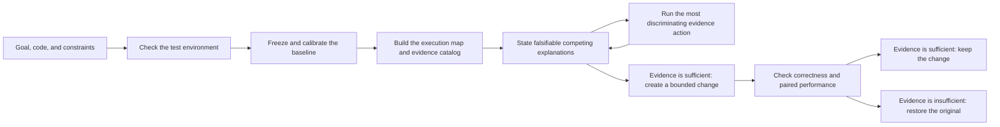

> [!IMPORTANT]
> This historical repository is archived. Active development moved to
> [troycheng/cuda-kernel-optimizer](https://github.com/troycheng/cuda-kernel-optimizer),
> which starts with a clean V1.0.0 history. This repository preserves the
> complete pre-V1 development history.

  <picture>
    <source media="(prefers-color-scheme: dark)" srcset="asset/logo-wordmark-dark.svg">
    
  </picture>

<strong>Evidence-driven CUDA, CUTLASS and Triton optimization for Codex</strong>

  <a href="docs/getting-started.md">Get Started</a> ·
  <a href="docs/environment-readiness.md">Prepare a Workload</a> ·
  <a href="docs/workflows.md">Workflows</a> ·
  <a href="docs/evidence-and-safety.md">Evidence &amp; Safety</a> ·
  <a href="skills/cuda-kernel-optimizer/examples/walkthrough.md">Examples</a> ·
  <a href="README.zh-CN.md">简体中文</a>

## About

`cuda-kernel-optimizer` is a Codex skill for improving CUDA, CUTLASS, Triton,
and the GPU workloads around them. It can optimize a kernel, find a bottleneck
across a complete workload, validate a change against a serving objective, or
analyze an existing Nsight Compute report without rerunning its program.

The skill profiles the real target, makes bounded project changes, checks
correctness, and compares paired measurements. It also checks framework
scheduling, CPU and data work, transfers, communication, I/O, allocator behavior,
and runtime state when the evidence points outside a kernel.

Version 3.0 adds a deterministic long-run Controller. A frozen Workload Contract defines
the objective, environment, budget, measurement policy, and allowed scope. Signed evidence
and an append-only ledger keep interrupted, noisy, or drifted runs from silently changing the experiment.

V3.1 joins environment readiness and bottleneck analysis into a resumable active-
diagnosis loop. The AI checks required build, GPU, profiler, and workload-smoke
capabilities, then proposes competing explanations that measurements can disprove.
The Controller executes only frozen evidence actions, verifies outcome meaning and
content digests, including the actual launcher identity, and carries valid results into
the next round without spending budget twice.
The user still supplies the real workload and authorization. The only automatic repair
is a hash-locked pip install inside the declared isolated environment; host changes stay
recommendations, and `self_check` does not prove that the GPU environment is ready.

The skill never changes host-level settings automatically. Drivers, counter
permissions, clocks, power limits, services, and system configuration remain
recommendations unless the user separately authorizes them.

## Quick start

Installation is performed by Codex. Ask Codex to install or update
`skills/cuda-kernel-optimizer` from
[troycheng/cuda-optimized-skill](https://github.com/troycheng/cuda-optimized-skill),
then start a new session so the instructions are reloaded.

Provide a runnable target, correctness reference, target environment,
performance goal, constraints, and allowed modification scope. A real workload must be supplied by the user; the skill does not download or invent one. When a
foundation is missing, it reports the strongest result the current setup can
support and helps prepare project-local tests instead of claiming an unmeasured
speedup.

Choose `quick` for a 45-minute ceiling, `balanced` for the default three hours,
or `thorough` for up to ten hours. The run may stop earlier when the evidence is
conclusive or no useful direction remains.

> Use cuda-kernel-optimizer on this Triton workload. Confirm the reference, real inputs, target metric, allowed files, and environment first. Keep host settings unchanged and retain a change only when correctness and paired performance both pass.

See [Getting Started](docs/getting-started.md) for the input checklist.

## Choose a workflow

| Workflow | Use it when | Result boundary |
|---|---|---|
| **Environment readiness** | The workload, reference, benchmark, profiler, or target environment is incomplete | A gap report, claim ceiling, and project-local preparation plan |
| **Kernel optimization** | A CUDA, CUTLASS, or Triton implementation has a comparable reference | A kernel-level result with correctness and paired measurement evidence |
| **Complete workload** | The bottleneck may span GPU, framework, CPU, transfers, communication, I/O, or runtime state | A bounded diagnosis and end-to-end evaluation on the supplied workload |
| **Serving validation** | A local change must be checked against a product KPI | Frozen c1/c2/c4/c8/c12 strata, constraints, runtime identity, and separate performance and integrity decisions |
| **Existing NCU report** | A `.ncu-rep` exists and the original workload must not run | Read-only analysis with exact degradation when the report cannot be interpreted |

[Workflows](docs/workflows.md) explains the required inputs and supported claim
for each path. [Long-running Optimization](docs/long-running-optimization.md)
explains the 3.0 Controller, capability registry, calibration, audit cadence, and
recovery behavior.

## How it works

Before timed work, the Controller freezes the objective and authorized scope,
then estimates measurement noise and the minimum detectable effect. `green`
permits a candidate, `yellow` pauses for better measurement or baseline replay,
and `red` stops the run. The contract also limits how many candidates may run
between baseline audits.

Verified observations query only a few matching capability cards; cards supply methods, counterexamples, and checks, but do not decide results. Every admitted round starts with a falsifiable performance hypothesis.
Only a rehashed V2.5 evidence closure counts as an evaluated candidate. Environment readiness finishes before optimization timing starts; three minutes or 10% of the total budget is a progress review point, not a timer that kills an install or repair.
The Controller terminates the process group only when the command timeout or readiness hard deadline is reached. Tool work is not a performance improvement.

Direction headroom and stop/reopen rules remain in the
[direction-admission contract](skills/cuda-kernel-optimizer/references/direction_admission.md).
The detailed iteration rules are in the
[performance-first contract](skills/cuda-kernel-optimizer/references/performance_iteration.md).

## Evidence, not best-sample claims

A performance claim is accepted only when:

- correctness and every declared constraint pass;
- paired A/B samples follow the frozen schedule and aggregation rule;
- the default 95% confidence interval supports the required effect with enough valid pairs;
- the continuous shared-host guard covers timed work without missing, stale, or contaminated samples;
- formal serving evidence covers c1/c2/c4/c8/c12 and binds the measured binary to its execution path.

Missing, contradictory, contaminated, stale, or identity-invalid evidence must
fail closed. `performance_verdict` and `evidence_integrity` remain separate: a
fast number cannot repair an invalid experiment. The installed `self_check` is
CPU/static only and does not validate a GPU environment.

See [Evidence & Safety](docs/evidence-and-safety.md), the
[formal V2.5 reference](skills/cuda-kernel-optimizer/references/evidence_automation.md),
and the [long-run control reference](skills/cuda-kernel-optimizer/references/long_running_control.md).

## Validation status

[Validation status](docs/validation.md) records automated checks, the physical
RTX 5090 lane, tool permissions, and the 3.0 real-pair stability result.
[Case studies](docs/case-studies.md) keeps workload-specific historical results
separate. Neither page predicts the speedup of a new project.

## Release notes

The maintained release history starts with V2.2. These are project versions;
not every historical version has a matching Git tag.

### V3.1

Added pre-baseline readiness and a resumable active-diagnosis loop. The Controller
freezes evidence adapters and arguments, derives available capabilities from current
readiness results, executes one action under a per-run lock, and binds its outcome,
artifact, request history, and remaining budget to the next context. Exclusive
explanations cannot both pass. Tampered results, interrupted execution, identity drift,
and missing capabilities stop closed. Project content, adapter launchers, hypothesis
generations, and the committed ledger head are digest-bound. Direction experiments run
in a project copy; this is cooperative isolation, not an OS security sandbox.

The final patch turns the time-control lessons into runtime gates. The original business baseline runs before any candidate, every round inherits all proven mechanisms from the current champion, and applicable stages run in increasing cost order: static review, correctness, short paired screening, a profiler only for a live uncertainty, formal measurement, and—only for a serving claim—service validation. A failed stage prevents every later stage from starting.
Renaming a mechanism or changing only its parameters cannot spend another candidate slot. Long commands emit heartbeats and a terminal reason. Multi-provider AI review runs in parallel only after local evidence supports promotion, waits at most 180 seconds, and records complete responses and provider failures.

Mechanism tests and target-machine smoke are complete. Whether V3.1 finds a useful
direction faster than V3.0 still requires a user-supplied long-running workload; sample
data is not a workload-performance result.

### V3.0.1
Added a fail-closed single-variable software-stack audit, permanent invalid-
evidence quarantine, explicit composition rules, and a stop rule for measurement
runner maintenance. These changes came from a real Triton upgrade investigation.

### V3.0
Added a frozen Workload Contract, deterministic Controller, append-only replay,
evidence-bound Planner admission, a context-budgeted Capability Registry, and
noise/MDE calibration with mandatory periodic audits. External research remains
optional and local evidence remains decisive.

### V2.9
Reorganized public docs around user tasks; added readiness claim ceilings,
bounded offline knowledge, primary-source manifests, and optional independent review.

### V2.8
Added nonstationary serving comparability checks for balanced AB/BA evidence.

### V2.7
Added direction-level admission, conservative headroom, and stop/reopen history.

### V2.6
Added the performance-first iteration gate and bounded tool repair.

### V2.5
Added formal evidence automation, continuous guards, sealing, and audit.

### V2.4
Added the workload controller, bounded ChangeSets, and advisory host review.

### V2.3
Expanded portable CUDA, CUTLASS, Triton, report analysis, and systems coverage.

### V2.2
Established the dual-loop kernel/workload optimizer and RTX 5090 test lane.

## Documentation

- Start with [Getting Started](docs/getting-started.md), [Preparing a workload](docs/environment-readiness.md), and [Workflow selection](docs/workflows.md).
- Read [Long-running optimization](docs/long-running-optimization.md), [Evidence and safety](docs/evidence-and-safety.md), [Compatibility](docs/compatibility.md), and [Knowledge and research](docs/knowledge-and-research.md) for operating details.
- Project evidence is in [Validation status](docs/validation.md), [case studies](docs/case-studies.md), and the [RTX 5090 opt-in guide](tests/gpu/sm120/README.md).
- The AI protocol is [SKILL.md](skills/cuda-kernel-optimizer/SKILL.md); detailed contracts cover [performance iteration](skills/cuda-kernel-optimizer/references/performance_iteration.md), [direction admission](skills/cuda-kernel-optimizer/references/direction_admission.md), [long-run control](skills/cuda-kernel-optimizer/references/long_running_control.md), [software-stack comparison](skills/cuda-kernel-optimizer/references/version_stack_audit.md), [formal evidence](skills/cuda-kernel-optimizer/references/evidence_automation.md), and [canonical compatibility](skills/cuda-kernel-optimizer/references/compatibility.md).
- [Walkthrough](skills/cuda-kernel-optimizer/examples/walkthrough.md) · [MIT License](LICENSE)

This project is independent of CUDA, CUTLASS, Triton, and Nsight Compute. Use
those dependencies under their respective licenses.
