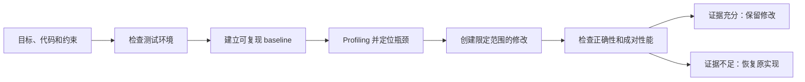

  <picture>
    <source media="(prefers-color-scheme: dark)" srcset="asset/logo-wordmark-dark.svg">
    
  </picture>

<strong>以证据驱动 Codex 优化 CUDA、CUTLASS 与 Triton</strong>

  <a href="docs/getting-started.md">快速开始</a> ·
  <a href="docs/environment-readiness.md">准备 Workload</a> ·
  <a href="docs/workflows.md">工作流</a> ·
  <a href="docs/evidence-and-safety.md">证据与安全</a> ·
  <a href="skills/cuda-kernel-optimizer/examples/walkthrough.md">示例</a> ·
  <a href="README.md">English</a>

## 项目简介

`cuda-kernel-optimizer` 是一个供 Codex 使用的可复用性能优化 skill。它可以优化单个
CUDA、CUTLASS 或 Triton kernel，诊断完整 GPU workload，验证 kernel 改动能否改善
serving 目标，也可以在不启动原程序的情况下分析已有 Nsight Compute report。

它把环境检查、profiling、限定范围的代码修改、正确性验证和成对性能测量组织成一个
可恢复的工作流。提供完整 workload 后，诊断范围不局限于 GPU kernel，还包括框架调度、
CPU 处理、数据传输、多卡通信、I/O 和运行环境。

Skill 只会修改已声明的项目路径和隔离项目环境，不会自动修改宿主机配置。驱动、权限、
频率、功耗限制和系统设置只提供建议。

## 快速开始

安装由 Codex 完成。让 Codex 从
[troycheng/cuda-optimized-skill](https://github.com/troycheng/cuda-optimized-skill)
仓库的 `skills/cuda-kernel-optimizer` 路径安装或更新 skill，然后开启新会话以重新加载
指令。

请提供可运行目标、正确性 reference、测试环境、性能目标、业务约束和允许修改的范围。
真实 workload 必须由用户提供；skill 不会自行下载或编造。
如果这些条件还不完整，skill 会先说明当前环境最多能支持什么结论，并帮助建立缺失的
项目内测试基础，不会直接把静态建议说成性能成果。

`quick` 最长 45 分钟；`balanced` 是默认的 3 小时预算；`thorough` 最长 10 小时，
用于更广的搜索和验证。

> 使用 cuda-kernel-optimizer 优化当前目录中的 Triton kernel。先确认 reference 和输入，保持宿主机设置不变，只有正确性与成对性能证据都通过时才保留改动。

输入清单和第一次任务边界见[快速开始](docs/getting-started.md)。

## 选择工作流

| 工作流 | 适用场景 | 结论边界 |
|---|---|---|
| **环境准备** | 缺少 workload、reference、稳定 benchmark、profiler 或目标环境 | 给出缺口、当前结论上限和项目内准备方案，不声称未经验证的提速 |
| **Kernel 优化** | 已有 CUDA、CUTLASS 或 Triton 实现及可比较 reference | 产出 kernel 级结论，包括正确性、编译器/profiler 证据、成对样本和置信度结果 |
| **完整 workload** | 延迟、吞吐或成本未达目标，但瓶颈未知 | 覆盖 kernel、框架、CPU、传输、通信、I/O 和环境的诊断，并进行限定范围的端到端评测 |
| **Serving 验证** | Kernel benchmark 已提升，需要验证产品 KPI | 冻结 c1/c2/c4/c8/c12 分层、serving-stack identity、逐层约束，并分别判定性能和证据完整性 |
| **已有 NCU report** | 已有 `.ncu-rep`，且不能重新运行被 profile 的 workload | 只读分析 report；导入结果不能证明当前 counter 权限或当前目标 identity |

[工作流说明](docs/workflows.md)列出每条路径需要的输入、允许修改的范围以及能够支持的结论。

## 工作方式

第一个候选开始前，工作流先冻结 baseline、环境和预先验证的测量路径。每轮优化都从一个
方向是否值得继续开始：根据已有测量计算保守上限，并把停止和重开写入只增不改的账本。
只对同一结论层的可比方向排序，不用人为权重把不同层次强行放在一起比较。完整规则见
[方向准入约束](skills/cuda-kernel-optimizer/references/direction_admission.md)。

Serving 数据还可能随负载、队列深度、缓存状态等运行条件波动。V2.8 会在性能门禁读取结果前，
先检查预先声明且顺序平衡的 AB/BA 序列，包括定长时间窗口、burn-in 到正式计时的状态变化、
成对状态、采集顺序和原始数据绑定。通过只代表两组数据可比，不代表 candidate 更快。具体规则见
[非平稳 serving 证据约束](skills/cuda-kernel-optimizer/references/nonstationary_serving_evidence.md)。

通过方向准入后，每轮优化都从一个能被实测推翻的性能假设开始；只有重新校验通过的 V2.5 证据闭环，才算真正评估过候选。
测量工具的修复有明确的时间和次数上限；超限后只切换到实现不同的冻结路径，没有可用路径
就停止该方向。修工具不等于性能提升，也不会作为优化成果汇报。具体规则见
[性能优先的迭代约束](skills/cuda-kernel-optimizer/references/performance_iteration.md)。

工作流在正式计时前冻结目标和授权范围。每个候选方案都绑定 source、binary、输入、
schedule、raw rows 和运行时 identity。被拒绝或中断的尝试会留下记录，但不会覆盖之前
有效的结果。

## 以证据为准，而不是选择最快样本

性能结论只有在证据闭合后才能成立：

- 正确性和所有声明约束通过；
- 成对 A/B 样本使用冻结的 schedule 和 aggregation 规则；
- 默认 95% 置信区间支持相对与绝对提升门槛，并且有效 pair 数量足够；
- continuous shared-host guard 完整覆盖正式计时阶段，不存在 unknown、缺采样、过期或
  污染样本；
- 正式 serving run 覆盖全部 c1/c2/c4/c8/c12 分层，并把 timed binary 绑定到已证明的
  execution path。

正式证据出现不确定、必需字段缺失、identity 漂移或环境污染时必须 fail closed。冻结的
实验开始后，不能排除不利样本，也不能只重试一侧 role 来补救结果。

`performance_verdict` 与 `evidence_integrity` 分开判定：更快的数字不能补偿无效 attempt。
安装后的 `self_check` 只执行 CPU/static 检查，不验证 GPU 环境。Claim ladder 和宿主机
边界见[证据与安全](docs/evidence-and-safety.md)。

## 验证情况

项目自身检查和 workload 结果分开说明：

- [验证情况](docs/validation.md)记录自动化检查、物理 RTX 5090 路径、工具权限，以及这些
  检查能证明和不能证明的内容。
- [案例](docs/case-studies.md)记录历史 workload 结果，包括最终被拒绝的 kernel 提升。
  其中的数字只适用于当时的代码、输入、环境和目标。

两者都不承诺新项目能获得相同提升。每个任务都要先确定当前结论上限，再用自己的正确性
和测量证据闭环。

## 版本记录

本项目从 V2.2 开始维护版本记录。这里记录的是项目版本，不代表每个历史版本都创建了对应的 Git tag。

### V2.9

按照用户任务重新组织公开文档，把开发历史移出 `docs`，并将 skill 入口压缩为按需路由。
新增环境准备与结论上限、限定数量的离线知识查询、workload 级方法卡、带日期的官方来源清单，
以及可选的外部搜索和多模型独立质证；候选方案是否晋级仍只由本地证据决定。

### V2.8

增加只读的非平稳 serving 证据门禁。测量前先用只写一次的 anchor 绑定设计，再按顺序平衡的 AB/BA 计划检查定长窗口、burn-in、
成对状态、时间顺序和原始数据身份。无法确认可比性时保留全部证据，
并给出下一次实验建议；门禁本身不声称性能提升，也不修改宿主机配置。

### V2.7

增加方向级准入、保守收益上限和只增不改的停止/重开账本。方向集合在建账时冻结，规范化证据与原始测量文件按字节绑定，已关闭方向不再参与推荐；相同上限不会因显示名称改变结论，重开必须引用原关闭记录，并提供新的窗口或目标、规范化证据和原始测量来源。AI 在进入 V2.6 候选迭代前，先判断这个方向是否还值得继续投入。

### V2.6

增加性能优先的迭代门禁：冻结假设，限制工具修复时间和次数，预先准备 fallback，并用机器可读结果区分候选进展与基础设施工作。

### V2.5

增加 shared host 和 serving 场景的正式证据自动化：冻结实验设计，持续检查环境，绑定 artifact 与 execution path，封存、审计并分别判定性能和证据完整性。

### V2.4

增加完整 workload controller、确定性的瓶颈诊断、限定范围的 ChangeSet、建议型 review，以及宿主机只给建议、不自动修改的边界。

### V2.3

扩展 CUDA、CUTLASS、Triton 的可移植覆盖，兼容 native 与 legacy 路径；增加只读 NCU report 分析、strategy memory，以及 systems、IR 和 serving 指南。

### V2.2

建立双循环优化框架：kernel 成对测量、用户真实 workload 验证、可恢复 checkpoint、sanitizer 与编译器证据、kernel/端到端结论分离，以及 RTX 5090 测试路径。

## 文档

- [快速开始](docs/getting-started.md)
- [准备 workload 和测试环境](docs/environment-readiness.md)
- [工作流选择](docs/workflows.md)
- [证据与安全](docs/evidence-and-safety.md)
- [兼容性](docs/compatibility.md)
- [验证情况](docs/validation.md)
- [案例](docs/case-studies.md)
- [知识、搜索与独立质证](docs/knowledge-and-research.md)
- [AI 执行协议](skills/cuda-kernel-optimizer/SKILL.md)
- [Kernel 与 workload walkthrough](skills/cuda-kernel-optimizer/examples/walkthrough.md)
- [性能优先的迭代约束](skills/cuda-kernel-optimizer/references/performance_iteration.md)
- [方向准入约束](skills/cuda-kernel-optimizer/references/direction_admission.md)
- [非平稳 serving 证据约束](skills/cuda-kernel-optimizer/references/nonstationary_serving_evidence.md)
- [V2.5 正式证据参考](skills/cuda-kernel-optimizer/references/evidence_automation.md)
- [Canonical 兼容性参考](skills/cuda-kernel-optimizer/references/compatibility.md)
- [RTX 5090 opt-in 测试说明](tests/gpu/sm120/README.md)
- [MIT License](LICENSE)

本项目独立于 CUDA、CUTLASS、Triton 和 Nsight Compute。请按照各依赖自身的许可证使用。
