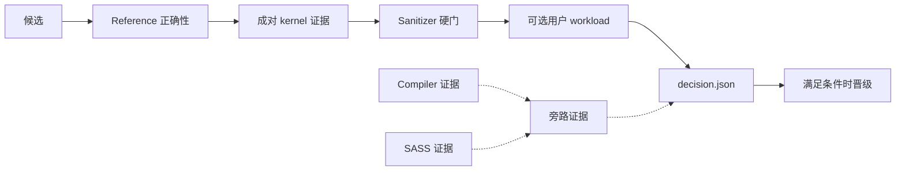
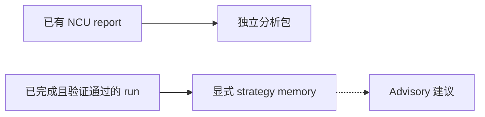

# cuda-kernel-optimizer

[English](README.md) | **简体中文**

这是一个用于优化 CUDA、CUTLASS 与 Triton kernel 的 Codex skill。V2.2 使用
双环流程：先确认 kernel 的正确性和收益；用户提供 workload 时，再检查真实
KPI。每次晋级都有可复核的持久证据。

## 按任务开始

- **优化 kernel**：从 baseline 和 Python reference 开始，运行受控候选循环。
- **验证真实 workload**：需要端到端结论时，显式提供 workload 和 objective。
- **分析已有 NCU report**：读取 `.ncu-rep`，不启动原 target。
- **使用显式 advisory memory**：记录已完成 run，再按严格 scope 获取搜索建议。
  它不修改 run，也不参与晋级。

## 安装

```bash
python3 "${CODEX_HOME:-$HOME/.codex}/skills/.system/skill-installer/scripts/install-skill-from-github.py" \
  --repo troycheng/cuda-optimized-skill \
  --ref main \
  --path skills/cuda-kernel-optimizer

cd "${CODEX_HOME:-$HOME/.codex}/skills/cuda-kernel-optimizer"
```

安装器不会覆盖已有目录。重新安装前先移走旧版本，再新建 Codex 会话。参与项目
开发时也可以进入 `skills/cuda-kernel-optimizer`；后面的命令无需调整。

## 开始第一次运行

先执行 setup。它会返回 `run_dir`；在 `open-iter` 中使用返回的 `run_dir`。

```bash
python3 scripts/orchestrate.py setup \
  --baseline /path/to/gemm.cu \
  --ref /path/to/ref.py \
  --dims '{"M":4096,"N":4096,"K":4096}' \
  --budget balanced

python3 scripts/orchestrate.py open-iter \
  --run-dir /path/to/run_YYYYMMDD_HHMMSS --iter 1
```

`setup` 校验并冻结输入，seed baseline，同时写入首个 checkpoint；它不会 profile
当前 best，也不会创建 branch 目录。`open-iter` 会 profile 当前 best、计算 Roofline 证据并创建 branch 目录，
数量受本轮预算限制。

接下来，Agent 或用户必须准备本轮要求的 branch kernel，并写好 `methods.json`
和 `analysis.md`。这些文件就绪后才能关闭本轮。

```bash
python3 scripts/orchestrate.py close-iter \
  --run-dir /path/to/run_YYYYMMDD_HHMMSS --iter 1
```

Decision 阶段完成后才能 finalize。

```bash
python3 scripts/orchestrate.py finalize \
  --run-dir /path/to/run_YYYYMMDD_HHMMSS
```

实际耗时取决于已冻结的预算。默认 `balanced` 最多运行 10,800 秒。

## 可信晋级路径



实线表示权威数据流。正确性、paired A/B 和 sanitizer 决定候选是否合格。
Compiler provenance 与 SASS 用来说明实现，不是硬晋级门。推进候选的唯一依据是
`decision.json`。

`kernel_only_win` 只确认 kernel 收益。没有 workload 时，它是正常成功结果；
workload failure/loss/inconclusive 后，它也可能是 full 模式的终局结果。它在
full 模式下不推进 global best。`end_to_end_win` 要求 kernel 与主 KPI 都确认
收益，且每项约束均通过；它是 full 模式唯一的 global best 晋级结果。

## 各任务命令

### 优化 kernel

先运行上面的首跑命令。后续轮次递增 `--iter`，并以 `checkpoint.json` 为准。
每轮写 branch 前，先看方法目录和当前可用的 profiler 证据。

### 验证真实 workload

```bash
python3 scripts/orchestrate.py setup \
  --baseline /path/to/gemm.cu \
  --ref /path/to/ref.py \
  --dims '{"M":4096,"N":4096,"K":4096}' \
  --budget balanced \
  --workload /path/to/workload.py
```

workload 必须由用户提供，skill 不会自行寻找、下载或编造。另两种输入形式是
`--workload-cmd ... --objective ...` 和 `--workload-manifest ...`。

### 分析已有 NCU report

```bash
python3 scripts/analyze_ncu_rep.py REPORT \
  --source SOURCE \
  --out-dir OUTPUT \
  --ncu-bin NCU \
  --ncu-num 5 \
  --timeout 120
```

必填项只有 `REPORT` 和 `--out-dir`。分析器只读取 report，不执行被 profile 的
target。

### 使用显式 advisory memory

```bash
python3 scripts/strategy_memory.py record \
  --memory MEMORY --run-dir RUN_DIR --out OUT

python3 scripts/strategy_memory.py suggest \
  --memory MEMORY --manifest MANIFEST --out OUT
```

每次都要明确传入 `--memory`。Orchestrator 没有默认 memory，也不会跨项目隐式
复用记录。

## 独立工具边界



Report 分析器最后写 `analysis.json`，把它作为完成标记。分析包记录
`counter_access: not_probed`；导入 report 不能证明当前 counter 权限、源码执行
或端到端效果。部分成功时退出码为 2，并指出缺失组件；硬失败不会发布新的完成
标记。

Strategy memory 只接收严格校验完成、manifest scope 完全一致的 V2.2 run。
建议是 detached 搜索提示。它不能删除 branch，不能改变 profiler 或预算策略，
也不能覆盖证据；它与 `decision.json` 和 promotion 没有连接。

## 输入、预算与状态

### 输入

每次优化都要提供 baseline `.cu` 或 Triton `.py` kernel、暴露
`reference(**kwargs)` 的 Python reference，以及 JSON 维度。真实 workload
不是必填项，但 `end_to_end_win` 必须有它。

三种 workload 形式只能选择一种：

- `--workload ./workload.py`：Python adapter；
- `--workload-cmd 'command ...' --objective ./objective.json`：argv 命令；
- `--workload-manifest ./workload.json`：严格 manifest。

```json
{
  "kind": "python",
  "source": "./workload.py",
  "objective": {
    "primary_metric": {"name": "p50_latency_ms", "direction": "lower"},
    "min_effect_pct": 1.0,
    "constraints": []
  },
  "cases": [{}]
}
```

Manifest 必须包含 `kind`、`source` 和 `cases`。Objective 只选一个来源：
内嵌 objective 或 --objective，不能同时使用。Python manifest 采用的 objective
还必须符合 adapter 的 `metrics()` contract。

### 计算预算

用户没有选择 preset 时，默认使用 `balanced`。

| 预设 | 最长秒数 | 分支数 | 最大轮数 | 最少 pairs | 最多 pairs | 外环候选 | 最多 cases | Sanitizer |
|---|---:|---:|---:|---:|---:|---:|---:|---|
| `quick` | 2700 | 4 | 2 | 20 | 50 | 1 | 3 | targeted |
| `balanced`（默认） | 10800 | 8 | 4 | 20 | 100 | 2 | 10 | targeted |
| `thorough` | 36000 | 16 | 8 | 30 | 200 | 3 | unlimited | full |

只有提供全部必填限制时才使用 `--budget custom`。Deadline 会停止接纳新阶段并
保留可恢复 checkpoint；不完整证据不会变成 win。

### 终局状态

- `kernel_only_win`：只确认 kernel 结果。Full 模式下 global best 保持不变。
- `end_to_end_win`：kernel 和 workload 都确认收益，且所有约束通过；这是 full
  模式的晋级状态。
- `rejected_constraint`：至少一项 workload 约束确认失败。
- loss、timeout、failure 或 `inconclusive`：保留当前 best。

## 产物与恢复

```text
run_YYYYMMDD_HHMMSS/
├── manifest.json                  # 冻结输入和策略
├── state.json                     # 候选注册表和历史
├── checkpoint.json                # 持久恢复边界
├── env.json                       # GPU 与工具链快照
├── workload/spec.json             # 冻结 workload 或 null
├── baseline/bench.json
├── itervN/
│   ├── branches/<candidate>/paired_samples.jsonl
│   ├── sanitizer.json
│   ├── sass_check.json
│   ├── workload/<hash>/paired_samples.jsonl
│   └── decision.json              # 晋级权威
└── summary.md
```

```bash
python3 scripts/orchestrate.py resume --run-dir \
  /path/to/run_YYYYMMDD_HHMMSS
```

Resume 会校验冻结身份并报告下一个未完成阶段，不会重放已完成阶段。Profiler、
sanitizer、compiler 或 workload 的可选覆盖若缺失或降级，`summary.md` 会明确
保留这一事实。

## 兼容性与验证

优化 kernel 需要 Python 3.10+、CUDA GPU、正常驱动和 CUDA 版 `torch`。
Triton kernel 还需安装 `triton`；CUDA/CUTLASS 使用 `nvcc`；CUTLASS build
需要 `$CUTLASS_PATH` 或 `$CUTLASS_INCLUDE_DIR` 指定 headers；SASS 证据来自
`cuobjdump`。这个任务可以不做 NCU profile；无法运行时会明确记录为 unavailable
或 degraded。

独立 report 分析需要 Python 3.10+ 和兼容的 `ncu`。它只导入指定 report，
不启动 GPU target。

Strategy memory 只需要 Python 3.10+，支持 POSIX 语义的 Darwin/Linux 系统。
存储位置必须支持 file lock 和 atomic rename。

这个 skill 不重新分发 CUDA、CUTLASS、Triton 或 Nsight Compute。

当前 CPU 验收共 611 项：607 项通过，4 项 opt-in RTX 5090 测试跳过，失败为
0。25/25 个脚本均通过 `py_compile` 和 `--help` smoke check，skill validator
也确认结构有效。

V2.2 已于 2026-07-17 在物理 RTX 5090 上验证。当前环境与兼容环境各完成
11/11 项检查，NCU 版本分别为 2026.2.1 和 2025.3.1。移除 capability 后，
硬件 counter 返回 `ERR_NVGPUCTRPERM`。验收只接受这个精确结果，或真正采集到
metrics 的成功 profile。测试没有增加特权、capability，也没有修改驱动策略。

隔离的用户 vLLM 二进制 workload 使用 `balanced`：1 轮、2 个 branch、上限
10,800 秒。Kernel paired A/B 在 100 个有效 pair 上提升 **26.3287%**，95% CI
为 **[22.1801%, 30.6322%]**。Workload `latency_us` 变化 **-0.0097%**，CI 为
**[-0.0390%, 0.0365%]**，没有达到 2% 效果门槛。终局结果是
`kernel_only_win`，global best 仍为 baseline。运行耗时 2,232.43 秒。这是
二进制 A/B 证据，不是源码级晋级证明。

<details>
<summary>独立 NCU report 验收</summary>

Report 分析器在 2026-07-17 单独验收。宿主机有 8x RTX 5090，驱动版本
595.71.05，NCU 版本 2026.1.1.0。原 report 大小为 5,966,669 bytes。复制前、
复制后和分析后的 SHA-256 完全相同：
`01a1356a487cc1ce77c6af541508db2c5a673dbfa9370bed30d095162321574d`。

分析器退出码为 2，唯一的 partial 原因是 summary 命令返回 1；details 和 raw
CSV 可用，共解析 140 项 metrics。分析包记录 `counter_access: not_probed`，
6/6 个 supporting artifact hash 一致，严格 verifier 通过 32/32 项检查。验收
没有启动 workload，也没有修改 driver、NCU 或 counter 配置。
`verification.json` SHA-256 为
`af1ca2f57081f4420d13662127338906d5b808b52a75f53f18c27787d624359e`。

</details>

Opt-in 命令见 [SM120 测试说明](tests/gpu/sm120/README.md)，版本和架构路由见
[兼容性说明](skills/cuda-kernel-optimizer/references/compatibility.md)。

## 参考与许可证

- [Skill 正式流程](skills/cuda-kernel-optimizer/SKILL.md)
- [完整示例](skills/cuda-kernel-optimizer/examples/walkthrough.md)
- [优化目录](skills/cuda-kernel-optimizer/references/optimization_catalog.md)
- [NCU 指标指南](skills/cuda-kernel-optimizer/references/ncu_metrics_guide.md)
- [Serving 证据协议](skills/cuda-kernel-optimizer/references/serving_evidence_protocol.md)
- [系统与 Triton IR 证据](skills/cuda-kernel-optimizer/references/systems_and_ir_coverage.md)
- [Sanitizer 策略](skills/cuda-kernel-optimizer/references/sanitizer_policy.json)

这个 skill 独立于 CUTLASS、Triton 和 Nsight Compute，也不重新分发它们；请按
各自许可证单独安装依赖。
