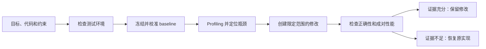

  <picture>
    <source media="(prefers-color-scheme: dark)" srcset="asset/logo-wordmark-dark.svg">
    
  </picture>

<strong>以证据驱动 Codex 优化 CUDA、CUTLASS 与 Triton</strong>

  <a href="docs/getting-started.md">快速开始</a> ·
  <a href="docs/environment-readiness.md">准备 Workload</a> ·
  <a href="docs/workflows.md">工作流</a> ·
  <a href="docs/evidence-and-safety.md">证据与安全</a> ·
  <a href="skills/cuda-kernel-optimizer/examples/walkthrough.md">示例</a> ·
  <a href="README.md">English</a>

## 项目简介

`cuda-kernel-optimizer` 是一个供 Codex 使用的 GPU 性能优化 skill。它可以优化
CUDA、CUTLASS 或 Triton kernel，排查完整 workload 的瓶颈，验证修改能否改善
serving 指标，也可以在不重新运行原程序的情况下分析已有 Nsight Compute report。

Skill 会在真实目标上做 profiling，只修改限定的项目路径，先检查正确性，再比较成对
性能数据。瓶颈不在 kernel 时，它还会检查框架调度、CPU 和数据处理、传输、通信、I/O、
allocator 与运行状态。

3.0 增加了确定性的长任务 Controller。Workload Contract 会冻结目标、环境、预算、
测量规则和修改范围；签名证据与只增不改的账本负责决定是否继续。任务中断、环境噪声
升高或身份漂移时，系统不会悄悄改变实验。

在 3.1 开发版本中，AI 会自动完成环境准入检查。必需能力没有通过时，不会启动 baseline。
真实 workload 和明确授权由用户提供。带哈希锁定的隔离环境 pip 是唯一允许自动执行的修复；
宿主机改动仍然只给建议。`self_check` 通过不代表 GPU 环境已经可用。

Skill 不会自动修改宿主机配置。驱动、counter 权限、频率、功耗限制、服务和系统设置
都只给建议，除非用户另行明确授权。

## 快速开始

安装由 Codex 完成。让 Codex 从
[troycheng/cuda-optimized-skill](https://github.com/troycheng/cuda-optimized-skill)
安装或更新 `skills/cuda-kernel-optimizer`，然后开启新会话，让新指令生效。

请提供可运行目标、正确性 reference、目标环境、性能目标、约束和允许修改的范围。
真实 workload 必须由用户提供；skill 不会自行下载或编造。缺少基础条件时，它会先说明
当前最多能得到什么结论，并帮助补齐项目内测试，不会把静态判断写成提速成果。

`quick` 最长 45 分钟，`balanced` 是默认的 3 小时，`thorough` 最长 10 小时。
证据已经明确或没有值得继续的方向时，任务会提前结束。

> 使用 cuda-kernel-optimizer 优化这个 Triton workload。先确认 reference、真实输入、目标指标、允许修改的文件和目标环境。保持宿主机设置不变，只有正确性与成对性能证据都通过时才保留修改。

输入清单见[快速开始](docs/getting-started.md)。

## 选择工作流

| 工作流 | 适用场景 | 能支持的结论 |
|---|---|---|
| **环境准备** | 缺少 workload、reference、benchmark、profiler 或目标环境 | 缺口、当前结论上限和项目内准备方案 |
| **Kernel 优化** | CUDA、CUTLASS 或 Triton 实现已有可比较 reference | 带正确性与成对测量证据的 kernel 级结论 |
| **完整 workload** | 瓶颈可能横跨 GPU、框架、CPU、传输、通信、I/O 或运行状态 | 对用户 workload 的限定范围诊断与端到端评测 |
| **Serving 验证** | 需要确认局部修改能否改善产品 KPI | 冻结 c1/c2/c4/c8/c12 分层、约束、运行身份，并分别判定性能和证据完整性 |
| **已有 NCU report** | 已有 `.ncu-rep`，不能重新运行原 workload | 只读分析；无法解析时准确记录降级原因 |

[工作流说明](docs/workflows.md)列出各路径需要的输入和结论范围。
[长任务优化](docs/long-running-optimization.md)说明 3.0 的 Controller、能力库、
校准、周期 audit 和恢复方式。

## 工作方式

正式计时前，Controller 会冻结目标与授权范围，估计测量噪声和最小可检测效应。
`green` 允许进入候选实验，`yellow` 暂停并改善测量或重放 baseline，`red` 停止任务。
合同还会限制两次 baseline audit 之间最多能运行多少候选。

通过验证的观察只检索少量匹配的 capability card。能力卡提供方法、反例和检查办法，
不负责判定结果。每轮都从一个能被实测推翻的性能假设开始；只有重新校验通过的 V2.5
证据闭环才算真正评估过候选。测量工具的修复有明确的时间和次数上限，修工具不等于
性能提升。

方向是否值得继续见[方向准入约束](skills/cuda-kernel-optimizer/references/direction_admission.md)，
候选迭代规则见[性能优先约束](skills/cuda-kernel-optimizer/references/performance_iteration.md)。

## 以证据为准，而不是选择最快样本

性能结论需要同时满足：

- 正确性和所有声明约束通过；
- 成对 A/B 样本遵守冻结的 schedule 与 aggregation 规则；
- 默认 95% 置信区间支持要求的效应，并且有效 pair 足够；
- continuous shared-host guard 完整覆盖正式计时，不缺采样、不过期、不受污染；
- 正式 serving 证据覆盖 c1/c2/c4/c8/c12，并把 measured binary 绑定到真实 execution path。

必需证据缺失、互相矛盾、受到污染、过期或身份不符时必须 fail closed。
`performance_verdict` 与 `evidence_integrity` 分开判定：更快的数字不能补救无效实验。
安装后的 `self_check` 只执行 CPU/static 检查，不验证 GPU 环境。

进一步说明见[证据与安全](docs/evidence-and-safety.md)、
[V2.5 正式证据参考](skills/cuda-kernel-optimizer/references/evidence_automation.md)和
[长任务 Controller 参考](skills/cuda-kernel-optimizer/references/long_running_control.md)。

## 验证情况

[验证情况](docs/validation.md)记录自动化检查、物理 RTX 5090 路径、工具权限，以及
3.0 使用真实 GPU pair 得到的稳定性结论。[案例](docs/case-studies.md)单独记录历史
workload 结果。两者都不承诺新项目能获得相同提速。

## 版本记录

本项目从 V2.2 开始维护版本记录。这里记录项目版本，并不表示每个历史版本都有 Git tag。

### V3.1 (development)

环境准入仍在开发中。AI 会在 baseline 前验证真实编译、GPU 执行、profiling、sanitizer 和
workload smoke；隔离修复有明确上限，环境身份变化后会重新检查。

### V3.0.1

增加单变量软件栈对照检查、无效证据永久隔离、组合候选规则和测量工具维护停止条件。
这些补丁来自一次真实的 Triton 升级排查，并按 3.0 的 fail-closed 标准重新实现。

### V3.0

增加 Workload Contract、确定性 Controller、只增不改的回放账本、与证据绑定的 Planner
准入、受上下文预算约束的 Capability Registry，以及噪声/MDE 校准和强制周期 audit。
外部检索仍是可选增强，最终以本地证据为准。

### V2.9

按用户任务重组公开文档，增加环境准备与结论上限、离线知识、官方来源清单和独立质证。

### V2.8

增加非平稳 serving 的成对状态可比性检查。

### V2.7

增加方向级准入、保守收益上限和停止/重开记录。

### V2.6

增加性能优先的迭代门禁和有上限的工具修复。

### V2.5

增加 shared host 与 serving 的正式证据、持续 guard、封存和 audit。

### V2.4

增加 workload controller、限定范围的 ChangeSet 和宿主机建议。

### V2.3

扩展可移植 CUDA、CUTLASS、Triton、report 分析和 systems 覆盖。

### V2.2

建立 kernel/workload 双循环优化器和 RTX 5090 测试路径。

## 文档

- [快速开始](docs/getting-started.md)
- [准备 workload](docs/environment-readiness.md)
- [工作流选择](docs/workflows.md)
- [长任务优化](docs/long-running-optimization.md)
- [证据与安全](docs/evidence-and-safety.md)
- [兼容性](docs/compatibility.md)
- [验证情况](docs/validation.md)与[案例](docs/case-studies.md)
- [知识、搜索与独立质证](docs/knowledge-and-research.md)
- [AI 执行协议](skills/cuda-kernel-optimizer/SKILL.md)与[示例](skills/cuda-kernel-optimizer/examples/walkthrough.md)
- [性能迭代](skills/cuda-kernel-optimizer/references/performance_iteration.md)、[方向准入](skills/cuda-kernel-optimizer/references/direction_admission.md)和[长任务控制](skills/cuda-kernel-optimizer/references/long_running_control.md)
- [软件栈版本对照](skills/cuda-kernel-optimizer/references/version_stack_audit.md)
- [正式证据](skills/cuda-kernel-optimizer/references/evidence_automation.md)与[兼容性参考](skills/cuda-kernel-optimizer/references/compatibility.md)
- [RTX 5090 opt-in 测试说明](tests/gpu/sm120/README.md)
- [MIT License](LICENSE)

本项目独立于 CUDA、CUTLASS、Triton 和 Nsight Compute。相关依赖遵循各自许可证。
