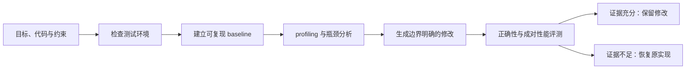

# cuda-kernel-optimizer

[English](README.md) | **简体中文**

`cuda-kernel-optimizer` 是一个面向 Codex 的 CUDA 性能优化项目，核心能力以
skill 形式提供。它既能优化单个 CUDA、CUTLASS 或 Triton kernel，也能分析和
优化用户提供的完整 GPU workload。

用户提供可运行代码、测试环境和性能目标后，AI 会完成环境检查、性能分析
（profiling）、瓶颈定位、代码修改和成对 A/B 测试。修改只有在结果正确、性能提升
达到目标且所有约束满足时才会保留。

项目可以修改授权范围内的 kernel、运行参数和项目代码。涉及驱动、权限、频率、
功耗或其他宿主机配置时，只给出建议，不会自动执行。

## 项目是什么

这是一个由 AI 执行的性能优化工作流。它把环境检查、baseline、profiling、候选修改、
正确性校验和性能评测串成可恢复的过程，并把每次判断所依据的数据保存下来。

项目不会预设瓶颈一定在 kernel 内。面对完整 GPU workload 时，分析范围还包括
framework 调度、CPU 数据处理、主机与设备间传输、多 GPU 通信、I/O 和运行环境。
如果证据指向宿主机配置，结果中会给出建议，但不会直接改动机器。

## 可以解决哪些问题

| 任务 | 适用场景 | AI 会做什么 | 主要结果 |
|---|---|---|---|
| **优化单个 kernel** | 已有 CUDA、CUTLASS 或 Triton 实现，并有可比较的 reference | 检查正确性，分析编译与 profiling 数据，迭代实现并做成对性能测试 | 修改后的 kernel 和可复核的性能收益 |
| **优化完整 GPU workload** | 延迟、吞吐或成本不达标，但瓶颈位置尚不确定 | 运行 workload，区分 kernel、framework、CPU、传输、通信、I/O 与环境问题，再修改授权范围内的代码或参数 | 瓶颈结论、修改方案和端到端结果 |
| **在真实 workload 上验证优化** | kernel 跑分快了，需要确认业务指标是否同步改善 | 在用户提供的真实输入上比较修改前后结果，同时检查精度、显存、输出等约束 | 可以采用的端到端结果，或不采用修改的明确原因 |
| **分析已有 NCU report** | 已经有 `.ncu-rep`，不希望重新启动被测程序 | 读取 report，整理热点 kernel、关键指标和可能的限制因素 | 独立的 NCU 分析结果，不触发新的 GPU workload |

## 需要提供什么

项目能否给出可靠结论，取决于输入是否能代表真实目标。通常需要：

- **可运行对象**：baseline kernel、完整 workload，或已有的 NCU report；
- **正确性标准**：Python reference、测试用例、校验函数或可比较的输出；
- **测试环境**：目标 GPU、驱动和依赖已经可用，或者允许 AI 在隔离环境中补齐依赖；
- **性能目标**：例如延迟、吞吐、显存、成本或某个业务 KPI；
- **约束条件**：精度、输出一致性、显存上限、允许修改的文件和不能触碰的配置；
- **计算预算**：允许使用的时间和搜索规模。

真实 workload 必须由用户提供。项目不会自行下载、编造或用微基准替代真实业务输入。
如果只有 kernel 和 reference，可以确认 kernel 级结果，但不能把它表述为端到端收益。

用户未指定预算时，默认使用 `balanced`。

| 预算 | 最长时间 | 适用情况 |
|---|---:|---|
| `quick` | 45 分钟 | 快速检查思路，缩小候选范围 |
| `balanced` | 3 小时 | 默认选择，在搜索范围和耗时之间取平衡 |
| `thorough` | 10 小时 | 候选较多、需要更完整 profiling 和验证 |

最长时间是上限，不是固定耗时。达到明确结论、没有可行候选或证据不足时，任务可以提前结束。

## AI 会如何执行

AI 会先确认任务目标和允许修改的范围，再检查环境与输入。baseline 可复现后才开始
profiling 和候选修改。每次修改都绑定到明确的文件范围，并在相同测试条件下与原实现
比较。任务中断时可以从已保存的检查点继续，不需要重跑已经完成且身份未变化的阶段。

外部模型可以作为可选 reviewer 检查分析和修改理由。reviewer 只提供意见，最终是否
保留修改仍由本地正确性和性能证据决定。

## 如何确认优化结果

项目使用成对 A/B 测试比较修改前后的性能。相同输入会按交错顺序反复运行，降低机器
波动、缓存状态和运行顺序对结论的影响。

一项修改需要同时满足以下条件：

1. **正确性通过**：输出与 reference 或 workload 的校验规则一致；
2. **收益达到门槛**：性能提升不只是单次偶然值；
3. **统计证据支持结论**：默认检查 95% 置信区间（confidence interval）；
4. **约束全部满足**：精度、显存、checksum 或业务指标没有越界；
5. **测试对象没有漂移**：比较期间使用同一份输入、代码身份和环境定义。

结果变差、置信区间无法确认收益、正确性失败或任一约束越界时，项目会恢复原实现，
并记录失败发生在哪个环节。缺少 NCU counter 权限等可选信息时，会明确标注证据降级，
不会把缺失数据写成成功结论。

## 最终会得到什么

一次完整任务会交付：

- **修改后的代码**：仅包含已通过验证并在授权范围内的改动；
- **瓶颈分析**：说明限制因素位于 kernel、framework、CPU、传输、通信、I/O 还是环境；
- **性能对比**：baseline、候选结果、成对样本、提升比例和置信区间；
- **正确性与约束结果**：列出每项检查是否通过；
- **未采用方案**：说明哪些尝试无效、退化或证据不足，避免重复试错；
- **宿主机建议**：需要驱动、权限、频率或系统调整时给出操作建议和依据；
- **可恢复记录**：保存任务状态和关键结果，便于中断后继续或独立复核。

如果没有找到可靠收益，最终结果会明确写成「保留原实现」，而不是选择跑分最好但证据
不足的候选。

## 修改范围与安全限制

| 范围 | AI 可以做什么 | 限制 |
|---|---|---|
| 项目代码 | 修改用户明确授权的 kernel、调用代码和运行参数 | 实际改动必须与声明范围一致 |
| 隔离环境 | 在用户提供的 isolated environment 中安装或调整项目依赖 | 必须与项目目录和宿主机系统目录分开 |
| 宿主机配置 | 收集信息并提出建议 | 驱动、权限、频率、功耗和系统配置不会自动执行 |
| 第三方 reviewer | 接收分析摘要并返回审阅意见 | 不能运行回调命令，也不能决定是否保留修改 |

超出授权范围的文件变化、workload 漂移、预算过期或验证失败都会停止当前候选。回滚失败
时任务会标记为需要人工恢复，不会继续覆盖现场。

## 使用示例

> 优化当前目录里的 Triton kernel，目标机器是 RTX 5090。先确认 reference 和测试输入可用，再分析瓶颈；只有正确性和成对性能结果都通过时才保留修改。

> 分析这个 GPU workload 的延迟瓶颈。测试环境已经准备好，允许修改项目代码和运行参数；涉及宿主机配置时只给建议。

> 分析这个 NCU report，找出最值得处理的 kernel 和主要限制因素。不要重新运行原 workload，也不要修改驱动或 counter 权限。

> 使用 balanced 预算验证这次 CUDA 优化在真实 workload 上是否有效。主指标是 p95 延迟，显存不能增加超过 5%。

## 测试情况与兼容性

项目在 CPU 测试和物理 RTX 5090 环境中都做过验收。下面的数据说明工作流本身经过了
哪些验证，不代表任意项目都能获得相同提升。

| 验证内容 | 环境与结果 | 说明 |
|---|---|---|
| 自动化测试 | 共 690 项；685 项通过，5 项 RTX 5090 opt-in 测试在非 GPU 环境跳过，0 项失败 | 覆盖状态恢复、证据绑定、超时、回滚和输入校验 |
| RTX 5090 完整测试 | current lane 在 34.302 秒内通过 13/13 项检查 | 覆盖 CUDA、CUTLASS、Triton、NCU 和完整 workload controller |
| 可复现 workload fixture | 端到端延迟改善 60.4616%，约束检查通过 | 用于验证从瓶颈分析到保留修改的完整路径 |
| 用户提供的 vLLM workload | kernel 指标改善 26.3287%，真实 workload 变化 -0.0097% | 端到端收益不足，因此保留原实现，证明 kernel 跑分快不等于业务收益 |
| 已有 NCU report | 在不启动原程序的情况下解析 140 项 metrics | counter 权限未重新探测；`ERR_NVGPUCTRPERM` 会被记录为权限限制，不会触发提权 |

优化 kernel 需要 Python 3.10+、可用的 CUDA GPU 与驱动，以及相应工具链。Triton
任务需要 `triton`；CUDA/CUTLASS 编译需要 `nvcc` 和 CUTLASS headers；SASS 分析
使用 `cuobjdump`。NCU profiling 是可选能力，无法运行时会明确记录为 unavailable 或
degraded。

独立 NCU report 分析只需要兼容的 `ncu` 和 report 文件，不会启动被 profile 的程序。
项目不重新分发 CUDA、CUTLASS、Triton 或 Nsight Compute。

详细环境、版本和 SM120 验收方式见 [兼容性说明](skills/cuda-kernel-optimizer/references/compatibility.md)
与 [RTX 5090 测试说明](tests/gpu/sm120/README.md)。

## 安装与进一步文档

安装由 Codex 完成。将 [GitHub 仓库](https://github.com/troycheng/cuda-optimized-skill)
和 skill 路径 `skills/cuda-kernel-optimizer` 提供给 Codex，要求安装或更新该 skill；
安装后新建会话，使 Codex 重新加载技能说明。内网只读镜像位于
[GitLab](https://git.yukework.com/mlsys/cuda-optimized-skill)。

进一步文档：

- [AI 执行协议](skills/cuda-kernel-optimizer/SKILL.md)
- [完整 workload controller 示例](skills/cuda-kernel-optimizer/examples/workload-controller.md)
- [Kernel 优化 walkthrough](skills/cuda-kernel-optimizer/examples/walkthrough.md)
- [优化方法目录](skills/cuda-kernel-optimizer/references/optimization_catalog.md)
- [兼容性说明](skills/cuda-kernel-optimizer/references/compatibility.md)
- [RTX 5090 测试说明](tests/gpu/sm120/README.md)
- [MIT License](LICENSE)

这个项目独立于 CUTLASS、Triton 和 Nsight Compute。相关依赖按各自许可证安装和使用。
