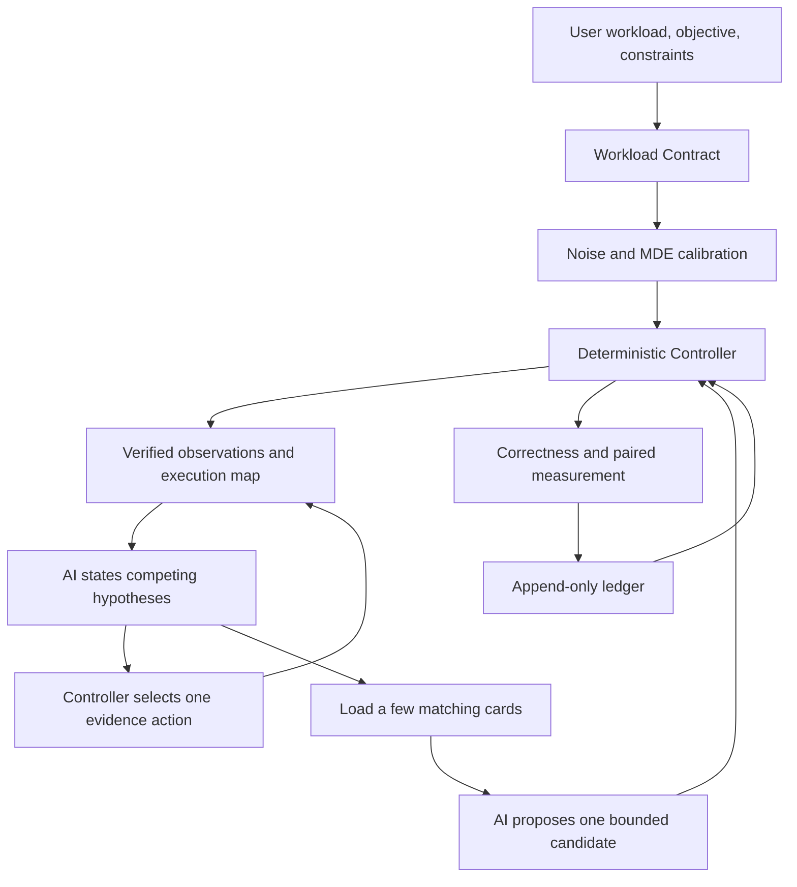

# Long-running optimization

Version 3.0 is designed for optimization work that may take hours, cross many
candidates, or resume after interruption. The AI still analyzes profiles and
writes code, but it does not control the rules of the experiment.

## The control loop

The **Workload Contract** freezes the real workload, target files, correctness
reference, metric, constraints, environment, budget, allowed paths, and host
policy. Changing one of those identities starts a new run; it does not silently
change the meaning of an existing result.

The **Controller** owns the clock, budget, state transitions, evidence adapters,
candidate admission, and ledger. The AI Planner can propose a hypothesis and a
small change, but it cannot change the contract, rewrite history, or declare its
own result successful.

The **Capability Registry** is a small, searchable library of methods. Queries
match exact architecture, task, observed signals, and available evidence before
loading a playbook. A card can suggest what to try and how to disprove it; it
cannot authorize execution or promotion.

V3.1 adds the active-diagnosis loop between the first global scan and candidate
admission. The Controller freezes user-owned evidence adapters, obtains available
capabilities from the current readiness report, and deterministically chooses one
request from the AI's competing hypotheses. The selected outcome has predefined
support and opposition effects. Those effects, the artifact digest, equivalent-request
history, and remaining profile budget become part of the next hash-bound context.

Each run has an exclusive mutation lock. A completed request is idempotent on resume.
An intent without a completion marker is never executed again or accepted manually;
the run stops at `manual_recovery` and a child or new run is required. A direction
experiment may use a project copy, but that copy is only cooperative isolation and
does not contain untrusted code.

## Measuring whether small changes are visible

Before exploring candidates, the Controller replays baseline-only pairs and
estimates measurement noise and the **minimum detectable effect**. The selected
budget supplies a default confidence, power, bootstrap count, pair count, and
audit cadence; advanced users may set them explicitly before the contract is
frozen.

The result has three states:

| State | Meaning | Action |
|---|---|---|
| `green` | Noise and MDE fit inside the minimum practical effect | Admit a candidate |
| `yellow` | The current setup cannot distinguish the required effect | Pause candidates and replay or improve measurement |
| `red` | A hard correctness or environment guard failed | Stop the run |

Invalid pairs stay visible but do not contribute to the baseline or statistics.
If no pair is valid, the result contains no invented timing value.

## Staying on course

Every candidate is registered before execution with its observation, hypothesis,
expected metric, cost, kill condition, capability versions, and modification
scope. Results are appended as `PASS`, `KILL`, `INCONCLUSIVE`, or `DEFERRED`.
An interrupted run reconstructs state by replaying the complete ledger rather
than trusting a mutable checkpoint.

The contract field `audit_every_candidates` limits how many candidates may be
registered between baseline audits. When it is reached, the run enters
`AUDITING`. Only an audit tied to the same contract, calibration anchor, source,
and environment can resume exploration. Online execution and ledger replay both
enforce this rule.

## External sources and models

External search and independent AI review are optional. They can add current
documentation, alternative explanations, and counterexamples after private
material is removed. They cannot change the Workload Contract, operate the
Controller, write the append-only ledger, or decide promotion. Offline runs use
the bundled source manifest and capability cards; local correctness and
measurement remain authoritative.

For input requirements, see [Getting Started](getting-started.md). For result
boundaries, see [Workflows](workflows.md) and
[Evidence & Safety](evidence-and-safety.md).
