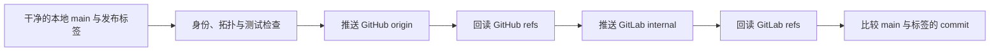

# GitHub 与内网 GitLab 受控双发布设计

## 背景

项目当前发布在用户的 GitHub fork：
`https://github.com/troycheng/cuda-optimized-skill.git`。用户还需要把正式版本同步到
内网 GitLab：`https://git.yukework.com/mlsys/cuda-optimized-skill`。

GitHub 继续作为唯一权威源。内网 GitLab 只接收已经通过验证的 `main` 和发布标签，
不承载独立开发，也不反向修改 GitHub。两个平台之间不建立双向镜像。

## 目标

- 使用一个可测试的本地发布工具同步 GitHub 与内网 GitLab。
- 只发布 `main` 和用户明确指定的版本标签。
- 在首次发布、正常快进和重复执行时得到确定结果。
- 在分叉、标签冲突或远端身份异常时停止，不覆盖任何远端提交。
- 每次推送后回读两个远端，确认分支和标签指向一致。
- 不在仓库、命令行参数或日志中保存访问令牌和私钥。

## 非目标

- 不同步开发分支、实验分支或 pull request refs。
- 不支持从 GitLab 反向同步到 GitHub。
- 不使用 `--force`、`--mirror`、远端删除或历史改写。
- 不配置 GitHub Actions、GitLab CI、定时任务或平台级镜像。
- 不承诺跨 GitHub 与 GitLab 的原子事务。GitHub 成功而 GitLab 失败时，
  工具必须报告部分完成，不能回滚已经公开的 GitHub 版本。

## 仓库角色与远端

| 名称 | 地址 | 角色 |
|---|---|---|
| `origin` | `https://github.com/troycheng/cuda-optimized-skill.git` | 唯一权威源和第一发布目标 |
| `internal` | `git@git.yukework.com:mlsys/cuda-optimized-skill.git` | 内网只读镜像和第二发布目标 |
| `upstream` | `https://github.com/KernelFlow-ops/cuda-optimized-skill.git` | 仅拉取参考；push URL 必须保持 `DISABLED` |

发布工具只接受表中两个精确的写入目标。发现 remote 缺失时给出配置命令，发现地址不符时
直接失败。工具不修改全局 Git 配置，不安装凭据，也不读取或打印私钥。

## 用户接口

新增 `tools/publish_dual_remote.py`：

```bash
# 只检查，不推送；这是默认行为
python3 tools/publish_dual_remote.py --tag v2.3.0

# 完成全部检查后执行双发布
python3 tools/publish_dual_remote.py --tag v2.3.0 --execute
```

`--tag` 必须是本地已有的带注释标签，且解引用后的 commit 必须可从本地 `main` 到达。
工具只允许在干净的 `main` 上执行。默认 dry-run 输出将要读取和推送的精确 refs；
只有 `--execute` 允许写远端。

## 发布流程



### 1. 本地检查

工具依次确认：

1. 当前分支是 `main`，工作区和 index 均为空。
2. `origin`、`internal` 和 `upstream` 的 URL 与允许列表完全一致。
3. `upstream` 的 push URL 是 `DISABLED`。
4. 指定标签存在、是带注释标签，并且其 peeled commit 可从 `main` 到达。
5. 完整 CPU 测试和 skill 结构校验通过。测试失败时不访问写入路径。

### 2. 远端拓扑检查

工具使用 `git ls-remote` 读取两个发布目标的 `main`、标签对象和 peeled 标签 commit：

- 远端没有 `main`：允许首次创建。
- 远端 `main` 等于本地 `main`：视为幂等成功。
- 远端 `main` 是本地 `main` 的祖先：允许快进。
- 远端 `main` 领先或分叉：立即停止。
- 远端没有同名标签：允许创建。
- 远端同名标签的对象和 peeled commit 均一致：视为幂等成功。
- 同名标签任一身份不同：立即停止。

拓扑判断只基于已 fetch 的远端对象。判断前必须刷新 refs，不能使用可能过期的
remote-tracking branch。

### 3. 写入与回读

写入顺序固定为 GitHub、GitLab。每次只传递两个显式 refspec：

```text
refs/heads/main:refs/heads/main
refs/tags/<tag>:refs/tags/<tag>
```

不得拼接用户提供的 shell 字符串；所有 Git 子进程都使用参数数组并设置
`GIT_TERMINAL_PROMPT=0`。GitHub 推送后立即回读；只有分支和标签都匹配本地身份，
才进入 GitLab 阶段。GitLab 推送后执行相同回读。

## 失败语义

| 失败位置 | 结果 | 后续处理 |
|---|---|---|
| 本地、身份、测试或拓扑检查 | `not_started` | 修复问题后重新执行 |
| GitHub push 或回读 | `github_failed` | 不访问 GitLab 写入路径 |
| GitLab push 或回读 | `internal_pending` | 保留 GitHub 结果；修复连接或权限后幂等重试 |
| 两个远端均匹配 | `complete` | 发布完成 |

工具以非零退出码表示前三类失败，并输出不含凭据的 JSON 摘要。摘要包含本地 commit、
标签对象、peeled commit、每个远端的写入状态和下一步操作。

## 首次同步

内网仓库当前为空，SSH 账号 `@chengtong` 已通过只读连接测试。首次同步分两步：

1. 添加并校验 `internal` remote，不修改 `origin` 或 `upstream`。
2. 把已经发布的 `main@416f416fe37a3834a92c8849c3fe7dd79c8a7c3a` 和
   `v2.3.0` 精确推送到内网，再用 `git ls-remote` 比较两个平台。

首次同步不能顺带发布当前功能分支，也不能创建新版本标签。

## 测试

新增本地 bare repository 测试，不依赖 GitHub、GitLab 或真实凭据。至少覆盖：

- 空镜像首次发布；
- 两个远端正常快进；
- 分支和标签均已一致时重复执行；
- GitHub 或 GitLab 分支领先、分叉；
- 同名标签对象或 peeled commit 冲突；
- GitHub 成功、GitLab 写入失败；
- 默认 dry-run 不产生远端写入；
- remote URL 或 `upstream` push URL 不符合允许列表；
- 脏工作区、非 `main`、轻量标签和不可达标签被拒绝；
- 命令执行不经过 shell，输出不包含凭据。

实现完成后运行新增测试、完整 CPU 测试、skill validator、Python 编译和
`git diff --check`。真实远端验收只同步既有 `main` 与 `v2.3.0`，随后逐 ref 回读。

## 后续演进

工作负载优化器的后续版本继续调用同一个发布入口。若以后启用平台级镜像，仍保持
GitHub 单向流向 GitLab；只有平台镜像经过独立验收后，才移除本地第二次 push，避免
两个同步器同时工作。
