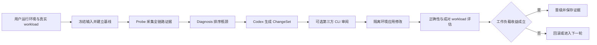

# GPU Workload Optimizer v2.4 控制层设计

## 背景

现有 skill 已能完成 CUDA、CUTLASS 和 Triton kernel 的双环优化，并用用户提供的
真实 workload 做成对验证。它的证据链、预算、checkpoint、正确性和晋级规则已经稳定，
但入口仍然以 kernel 为中心。真实生产瓶颈可能来自 CPU、数据加载、I/O、显存传输、
框架调度、通信、容器依赖或 kernel 本身。

v2.4 在现有双环之上增加工作负载控制层。Codex 负责分析和修改；确定性脚本负责采集、
约束、复测、记录和恢复。第三方模型可通过用户提供的本地 CLI 做独立审阅，但不拥有执行
或晋级权限。

## 已确认的产品边界

- 用户提供可运行、可压测、可 profile 的环境和真实 workload。
- 可自动修改项目代码、启动配置、容器、依赖和隔离构建环境。
- 宿主机、驱动、GPU 系统设置和内核参数只生成建议，不自动修改。
- Codex 是主分析者和修改者，不需要再调用模型生成代码。
- 第三方模型使用本地 CLI 和 JSON stdin/stdout 协议，只做可选审阅。
- GitHub fork 是权威仓库，内网 GitLab 是单向镜像；不向 upstream 推送。

## 目标

- 从真实 workload 建立可复算的基线，不要求用户先定位 kernel。
- 统一记录 GPU、kernel、CPU、数据、I/O、通信、框架和环境证据。
- 给出带证据引用的瓶颈排序；证据不足时明确返回 `inconclusive`。
- 让 Codex 根据诊断生成一个边界明确、可回滚的 `ChangeSet`。
- 在隔离环境完成修改、正确性检查、成对压测和最终晋级。
- 允许第三方模型审阅诊断、ChangeSet 和实验设计，意见完整留档。
- 复用 v2.2 的 workload adapter、预算、统计、artifact 和 checkpoint 语义。
- 组件接口可在以后挂到 DAG 调度器，不在 v2.4 实现通用 DAG。

## 非目标

- 不自动修改宿主机、驱动、BIOS、GPU power limit、MIG 或系统内核参数。
- 不内置任何模型供应商 SDK、HTTP API、账号、token 或默认 reviewer。
- 不自动发现、下载或构造用户的真实 workload。
- 不把 profiler 估算、模型意见或单次计时当作晋级证据。
- 不支持跨机器分布式调度；多机 workload 仍由用户提供的 adapter 或命令管理。
- 不重写现有 kernel 双环，不在本轮实现任意 DAG、并行节点或动态插件发现。

## 方案选择

### 方案 A：继续扩展 `orchestrate.py`

改动入口最少，但会把全链路诊断、第三方审阅和环境变更继续塞进已有大文件，kernel-first
阶段也会限制非 kernel 优化。该方案只适合一次性补丁。

### 方案 B：独立工作负载控制层

新增控制器和少量专用组件，现有 kernel 双环作为一个 Action adapter。控制器使用固定线性
阶段，先做全链路诊断，再选择 kernel 或非 kernel 方案。该方案能快速形成可用闭环。

### 方案 C：通用 DAG 引擎

把所有 probe、诊断、修改和评估建模为任意节点，需要节点协议、依赖调度、并发、资源锁、
重试、补偿、插件版本和配置迁移。扩展性最好，但首版成本约为方案 B 的 2～3 倍。

v2.4 选择方案 B，同时采用方案 C 的接口边界。未来只替换 `RunPlan` 调度器，不改 Probe、
Diagnosis、ChangeSet、Reviewer 和 Evaluator 的数据契约。

## 总体架构



## 输入契约

### 控制 manifest

控制器接受一个严格 JSON 文件。未知字段、重复 key、非有限数值和相对逃逸路径全部拒绝。

```json
{
  "schema_version": "cuda-workload-optimizer/control-v1",
  "project_root": "/workspace/project",
  "workload_manifest": "/workspace/project/workload.json",
  "baseline_candidate": {"name": "baseline", "revision": "abc123"},
  "budget": "balanced",
  "mutation": {
    "project_paths": ["src", "configs"],
    "environment_root": "/workspace/env-copy",
    "host_policy": "recommend_only"
  },
  "probes": [
    {
      "id": "timeline",
      "kind": "timeline",
      "argv": ["python3", "collect_timeline.py"],
      "timeout_seconds": 300
    }
  ],
  "reviewer": {
    "argv": ["reviewer-cli", "--json"],
    "timeout_seconds": 120
  }
}
```

`reviewer` 可以省略。`project_paths` 必须位于 `project_root`，`environment_root` 必须与
宿主机系统路径分离。`host_policy` 在 v2.4 只接受 `recommend_only`。

### Workload

`workload_manifest` 继续使用现有 `WorkloadSpec` 契约。用户拥有 prepare、validate、
benchmark、metrics 和 cleanup；控制层不猜测业务 KPI。`baseline_candidate` 和后续 candidate
只是传给 adapter 的 JSON 标识，不能包含凭据。

### Probe 命令

Probe 通过 argv 数组执行，绝不经过 shell。控制器为每次执行创建独立目录，并设置：

- `CUDA_OPTIMIZER_OUTPUT`：命令必须原子写入的规范化 JSON 路径；
- `CUDA_OPTIMIZER_RUN_DIR`：本次控制层 run 目录；
- `CUDA_OPTIMIZER_PROJECT_ROOT`：冻结的项目根目录。

控制器只传递允许列表中的环境变量。stdout/stderr 有大小上限并做 secret redaction。用户可以
用 Nsight Systems、PyTorch Profiler、`perf`、`py-spy`、`nvidia-smi`、DCGM、NCCL tests
或内部工具生成证据；v2.4 不绑定单一 profiler。

## 规范化 Probe 证据

每个 Probe 输出使用 `cuda-workload-optimizer/probe-v1`。除身份和原始 artifact hash 外，
核心 metrics 均可缺失；缺失表示未知，不填默认值。

| Metric | 单位 | 典型来源 | 支持的诊断 |
|---|---:|---|---|
| `gpu_busy_pct` | % | nvidia-smi/DCGM/timeline | GPU 空闲或饱和 |
| `kernel_time_pct` | % | Nsight Systems/PyTorch | kernel 主导 |
| `cuda_api_time_pct` | % | Nsight Systems | launch/API 开销 |
| `launch_gap_pct` | % | timeline | CPU 或框架调度间隙 |
| `cpu_busy_pct` | % | perf/py-spy/系统采样 | CPU 饱和 |
| `data_wait_pct` | % | framework/业务埋点 | DataLoader 或数据源等待 |
| `io_wait_pct` | % | 系统采样/业务埋点 | 存储或网络 I/O |
| `transfer_time_pct` | % | timeline | H2D/D2H/显存搬运 |
| `communication_time_pct` | % | NCCL/timeline | 多 GPU 通信 |
| `graph_replay_pct` | % | CUDA Graph/timeline | graph 覆盖与重放 |

百分比必须在 `[0, 100]`。一个 artifact 可以提供 `duration_ms`、tool 版本、采集 argv hash、
原始文件 SHA-256 和附加 JSON metrics。控制器不复制超出预算的大型原始 report，只记录
用户指定的 run-local 副本或稳定 hash。

## 组件设计

### `RunPlan`

阶段固定为：

```text
baseline -> probes -> diagnosis -> change -> review -> evaluation -> decision
```

`checkpoint.json` 记录当前阶段、round、已完成 artifact hash 和 `next_action`。每个阶段只能
从上一个已完成阶段推进。Resume 重新校验 manifest、workload、项目基线和 artifact 身份，
不会重放已完成阶段。

### `ProbeRunner`

`ProbeRunner` 执行 manifest 中的 Probe，使用进程组 timeout 和有界日志，校验 output
schema，并把原始 hash 绑定到规范化结果。失败、超时或工具不可用都写入 artifact，状态为
`unavailable` 或 `failed`，不会伪造零值。

控制层还运行一个不修改环境的 built-in environment probe，记录 CUDA、driver、Python、
容器、GPU、NCU 和常见 profiler 是否可用。它不自动安装工具。

### `DiagnosisEngine`

诊断是纯函数，输入为已验证的 Probe artifacts，输出：

- 排序后的瓶颈分类；
- 每个分类的 score、触发规则和精确 evidence path；
- evidence coverage；
- `high`、`medium`、`low` 或 `inconclusive` 置信等级；
- 需要追加的 Probe 建议。

分类集合固定为 `kernel`、`framework`、`cpu_data`、`transfer`、`communication`、`io`、
`environment` 和 `mixed`。规则阈值放在版本化 JSON policy 中，输出逐条记录命中的规则，
不让模型在无证据时自由生成结论。

若最高分类是 `kernel`，`next_action` 路由到现有 kernel 双环。其他分类由 Codex 生成对应
ChangeSet。覆盖不足或多个分类接近时返回 `mixed` 或 `inconclusive`，要求补充证据。

### `ChangeSet`

Codex 写入严格 JSON：

```json
{
  "schema_version": "cuda-workload-optimizer/change-v1",
  "id": "round-1-dataloader-workers",
  "hypothesis": "data wait dominates GPU idle time",
  "diagnosis_ids": ["cpu_data:data_wait"],
  "scope": "project",
  "candidate": {"name": "dataloader-workers-8", "revision": "worktree"},
  "paths": ["configs/serve.yaml"],
  "commands": [["python3", "-m", "pytest", "tests/test_config.py"]],
  "rollback": "restore_frozen_snapshot",
  "expected_metrics": ["data_wait_pct", "gpu_busy_pct", "p50_latency_ms"]
}
```

`scope` 只接受 `project` 或 `isolated_environment`。所有 path 必须落在 manifest 允许根目录；
`host` scope 直接拒绝。控制器冻结修改前身份，修改后验证实际 diff 未越界。Codex 执行编辑
和允许命令，控制器不接收任意 shell 文本。`candidate` 是交给现有 WorkloadSpec adapter 的
JSON 描述，必须与实际修改后的候选身份一致，并与评测 artifact 一起冻结。

宿主机建议单独写入 `host_recommendations.md`，包含证据、预期影响、风险和人工验证命令，
永远不进入 ChangeSet 执行队列。

### `Reviewer`

Reviewer 请求包含：诊断摘要、ChangeSet、脱敏 diff、实验计划、artifact hashes 和 request
digest。控制器通过 stdin 发送 JSON，通过 stdout 接收：

```json
{
  "schema_version": "cuda-workload-optimizer/review-v1",
  "request_digest": "sha256-value",
  "verdict": "challenge",
  "concerns": [
    {"severity": "medium", "category": "experiment", "message": "check warmup drift"}
  ],
  "suggested_experiments": ["repeat with fixed request trace"]
}
```

`verdict` 只接受 `support`、`challenge` 或 `insufficient`。Reviewer 没有 command callback、
状态路径或晋级句柄；输出只能成为 advisory artifact。它可以建议补实验，不能覆盖真实
benchmark 结论。

本地 CLI 仍是一个同权限进程，协议本身不能提供 OS 级只读保证。控制器使用空临时 cwd、
最小环境、stdin/stdout、timeout 和有界输出降低风险。需要强隔离时，用户应把 reviewer
CLI 放进只读容器或系统 sandbox；skill 不虚假声明未启用的隔离。

### `Evaluator` 与 `Promotion`

Evaluator 复用现有 `workload_evaluate`，按冻结 workload 做随机 AB/BA pairs。每次 candidate
必须先通过业务正确性，再按 workload 的 primary metric、`min_effect_pct` 和 constraints
判断。Probe 指标只用于解释和选择下一方案，不替代用户 KPI。

晋级要求：

1. ChangeSet diff 与允许范围一致；
2. 正确性通过；
3. workload primary metric 的置信区间达到实用效果门槛；
4. 所有 constraints 通过；
5. candidate、环境、workload 和 artifacts 身份未漂移。

第三方 reviewer 的 `support` 不是晋级条件，`challenge` 也不能推翻已经满足的统计规则；
它只影响下一轮实验建议和报告中的 review coverage。

## Artifact 布局

```text
workload_run_YYYYMMDD_HHMMSS/
├── control_manifest.json
├── state.json
├── checkpoint.json
├── environment.json
├── baseline/
│   └── observation.json
├── probes/
│   ├── <probe-id>.json
│   └── raw/<artifact>
├── diagnosis.json
├── rounds/
│   └── round-N/
│       ├── change_set.json
│       ├── before_identity.json
│       ├── after_identity.json
│       ├── review_request.json
│       ├── review.json
│       ├── workload_pairs.jsonl
│       └── decision.json
├── host_recommendations.md
└── summary.md
```

JSON completion marker 最后写入。失败阶段保留日志和部分 artifacts，但不能发布成功 marker。
所有输入、normalized artifacts、review request、ChangeSet 和 decision 都绑定 SHA-256。

## 预算与恢复

控制层沿用 `quick`、`balanced`、`thorough` 和完整 custom 预算。预算同时约束 Probe timeout、
reviewer timeout、ChangeSet 验证、workload pairs 和最大 rounds。Deadline 前停止接纳新阶段，
已完成阶段可恢复，进行中的外部进程按 TERM、grace、KILL、wait 顺序清理。

Reviewer 不可用不会消耗后续全部预算；状态记录 `not_reviewed` 并继续确定性评估。关键 Probe
缺失时 diagnosis 为 `inconclusive`，不得直接进入 promotion。

## 失败与降级

- Probe 输出缺失、格式错误、超时或工具不存在：记录具体状态，不填零值。
- NCU counter 权限不足：保留 `ERR_NVGPUCTRPERM`，继续其他证据，不提升权限。
- Reviewer 不可用、超时或输出不匹配 digest：记录 `not_reviewed`，不阻断实测。
- ChangeSet 越过项目或隔离环境根目录：执行前拒绝。
- 实际 diff 与 ChangeSet paths 不符：候选无效并回滚。
- Workload 正确性、KPI 或 constraints 失败：不晋级；保留 baseline。
- 回滚失败：状态为 `manual_recovery_required`，停止自动迭代并给出精确路径。
- 宿主机优化建议永远不自动执行，也不计入 candidate 收益。

## CLI 与 skill 入口

控制器使用一个脚本和显式子命令：

```bash
python3 <skill>/scripts/workload_controller.py setup --control CONTROL.json --output-root RUNS
python3 <skill>/scripts/workload_controller.py resume --run-dir RUN_DIR
python3 <skill>/scripts/workload_controller.py run-probes --run-dir RUN_DIR
python3 <skill>/scripts/workload_controller.py diagnose --run-dir RUN_DIR
python3 <skill>/scripts/workload_controller.py record-change --run-dir RUN_DIR --change CHANGE.json
python3 <skill>/scripts/workload_controller.py review --run-dir RUN_DIR
python3 <skill>/scripts/workload_controller.py evaluate --run-dir RUN_DIR
python3 <skill>/scripts/workload_controller.py finalize --run-dir RUN_DIR
```

用户的正常入口仍是自然语言：提供环境、workload、目标和预算。Codex 读取 `next_action`，
循环调用子命令、修改允许范围、验证和复测。用户不需要手工拼接整条流水线。

## 测试策略

### CPU 单元与契约测试

- control、Probe、ChangeSet 和 review schema 的严格校验；
- path、symlink、hash、重复 key、非有限值和 secret redaction；
- 每条 diagnosis rule 的正例、反例、缺失证据和 mixed 情况；
- reviewer CLI 的 argv、stdin/stdout、timeout、digest、日志上限和失败语义；
- checkpoint 单调推进、resume、deadline、进程组清理和并发写保护；
- ChangeSet 越界、diff 漂移、宿主机 scope 和回滚失败；
- workload evaluator 复用与 promotion authority 不回归。

### CPU 端到端 fixture

使用 fake workload、fake probes 和 fake reviewer 跑通：

```text
setup -> baseline -> probes -> diagnosis(cpu_data)
-> record-change -> review -> evaluation -> decision(end_to_end_win)
```

再覆盖 Probe 不足、reviewer 不可用、candidate loss、constraint rejection、diff 越界和 resume。

### RTX 5090 验收

在既有 5090 目标机的隔离目录验证：

- 环境 probe 与真实 tool availability；
- 用户提供 workload 的基线与至少一种真实 timeline/profile；
- kernel 和非 kernel 各一个 diagnosis fixture；
- 一次真实 ChangeSet、成对 workload 复测、失败回滚和成功晋级；
- reviewer 使用本地 fake CLI 验证协议，不上传真实源码或内部凭据；
- 宿主机建议只生成文档，检查主机配置未被修改。

## 发布与兼容

v2.4 新控制层与 v2.2 kernel 双环并存。旧命令、旧 run schema 和现有 strategy memory 不改
语义。README 只能在实现和真实验收完成后更新，文档必须区分已验证能力、可选工具和已知
限制。

通过完整 CPU 回归和受控 5090 验收后，版本合并到用户 fork 的 `main`，再用受控双发布
工具依次同步 GitHub 和内网 GitLab。`upstream` 继续保持禁止写入。
