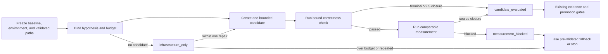

# V2.6 Performance-First Iteration Design

## Problem

The optimizer already has strong correctness, paired-measurement, identity, and
formal evidence contracts. A real Triton optimization task nevertheless spent
many consecutive iterations improving its benchmark runner instead of producing
code candidates or performance results. The infrastructure work was defensible
in isolation, but it displaced the optimization objective.

The failure is a control problem, not a missing profiler feature. Future AI
optimizers need a small, deterministic gate that makes performance work visible,
caps measurement-tool repair, and stops an unusable measurement path before it
turns into a runner-development project.

## Decision inputs

The design combines:

- the observed Triton task failure and its later recovery to a concrete Fast32
  candidate once runner work stopped;
- current CUDA, Nsight, Triton, PyTorch, KernelBench, TritonBench, DRTriton, and
  Atrex-Bench primary sources reviewed on 2026-07-18;
- independent reviews from Google AI Mode, DeepSeek, Kimi, and GLM using a
  public, de-identified description of the problem.

The independent reviews agreed on three risks: vague hypotheses, self-reported
progress classes, and an undefined "reliable harness" that could become another
runner rewrite. They also warned about dummy candidates and baseline drift.

## Scope

V2.6 P0 adds one read-only classifier, four strict input schemas, one reference,
and concise routing in the skill and public documentation. It applies to kernel,
complete-workload, and serving optimization rounds.

It does not:

- run a benchmark, profiler, build, or correctness command;
- modify code, a host, a driver, permissions, clocks, or power settings;
- replace the V2.5 evidence and promotion contracts;
- create or repair a measurement harness;
- introduce production-trace weighting, automated fallback detection,
  multi-candidate search, CUDA Tile, or distributed optimization.

## Performance iteration contract

Before round one, a create-once lineage anchor freezes the baseline source,
environment, prevalidated registry, and initial measurement path. Every admitted
round then starts with one falsifiable hypothesis:

- a concrete mechanism and statement;
- target metric and direction;
- minimum practical effect;
- authorized mutation scope;
- one measurement path selected from a prevalidated registry;
- a total round budget.

The round record contains observed infrastructure time and repair count plus an
optional SHA-256 reference to the existing V2.5 evidence closure. A small
`iteration_binding` artifact sealed in that closure binds the anchor,
environment, measurement implementation, hypothesis, and candidate source. The
record contains no self-reported correctness or performance result. The
classifier derives the work class; the AI cannot choose it.

| Derived class | Machine condition | Meaning |
|---|---|---|
| `candidate_evaluated` | A rehashed V2.5 seal/audit/decision closure contains a source different from the frozen baseline | A real terminal attempt completed; it may still be a loss |
| `measurement_blocked` | A candidate was declared, but no sealed closure completed | The measurement path blocked an experiment |
| `infrastructure_only` | No valid candidate exists and infrastructure work was recorded | Tool work occurred; it is not an optimization result |

The guard never claims `performance_gain`. A consistent `confirmed_win` is
forwarded to the existing paired-evidence and promotion gate, which owns raw
samples, statistics, and gain claims. A loss or inconclusive result remains
`candidate_evaluated`; completed unsuccessful experiments are useful search
evidence, not gains.

## Measurement path registry

A registry entry has an immutable `(id, version, definition_sha256)` identity
and `validated` status. The lineage anchor embeds the complete registry before
candidate work begins; every round binds the anchor digest and one frozen entry.

A fallback may select only another already validated registry entry. Creating,
editing, or validating a harness is a separate maintenance task and cannot be
charged to the same optimization round after the infrastructure budget is
exhausted. If no alternative exists, the direction stops honestly.

## Budget and stop rules

The default infrastructure allowance is:

```text
min(1200 seconds, floor(round_seconds * 0.15))
```

At most one infrastructure repair is allowed in a round. The gate derives the
next action using these rules, in order:

1. If infrastructure time or repair count exceeds the cap, switch to another
   prevalidated path or stop the direction.
2. If the current and previous round in the same anchor-derived hash chain are both
   `measurement_blocked` or `infrastructure_only`, switch to another
   prevalidated path or stop. Parallel lineages do not share this counter.
3. A single blocked round switches to another prevalidated path when available;
   it does not authorize building a new runner.
4. A single infrastructure-only round below budget must return to a candidate.
5. A completed candidate proceeds through existing evidence and promotion
   rules; the new gate never promotes by itself.

The gate rejects a sealed source equal to the frozen baseline, broken closure
digests, failed integrity audits, reordered previous decisions, anchor drift,
non-finite budgets, and a measurement path not present in the frozen registry.
Semantic review must still reject intentionally degraded or hypothesis-irrelevant
changes; language-independent AST heuristics are deliberately out of scope.

## State transition



## Release boundary

P0 is successful when CPU/static tests prove deterministic classification,
V2.5 closure rehashing, anchor and decision-chain binding, budget enforcement,
fallback selection, no-follow file access, and no command execution or host
mutation. GPU validation is not required because the component only validates
existing evidence and derives a decision.
