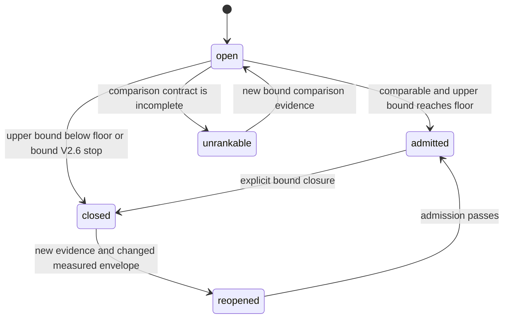

# V2.7 Direction Admission and Stop Ledger Design

## Problem

V2.6 makes candidate work visible and caps measurement infrastructure, but its
`stop_direction` result is still local to an iteration chain. A real TensorRT
optimization task repeatedly said that a selector direction was finished, then
reopened the same target under a new mechanism. The direction occupied about
5.5% of GPU kernel time, while late candidates sought roughly 0.2% incremental
gains and the serving endpoint remained unresolved.

The missing control is not another optimizer or profiler. It is a small,
machine-enforced answer to two questions before a new round:

1. Can this direction still reach the frozen minimum effect even if its measured
   component were eliminated completely?
2. Has this direction already been closed, and if so is there genuinely new
   bound evidence that permits reopening it?

## Decision inputs

This design combines:

- the current Triton/TensorRT task through Iter140;
- the V2.5 evidence closure and V2.6 iteration lineage contracts;
- current NVIDIA TensorRT benchmarking guidance, which separates GPU compute,
  enqueue time, transfers, and host wall time;
- reviews from Google AI Mode, DeepSeek, Kimi, and GLM.

The external reviews agreed that a stop-only note is insufficient and a full
orchestrator is too broad. They also identified three gaming surfaces: an AI can
invent an eliminable fraction, relabel a stopped direction, or treat estimated
experiment cost as evidence. The reviews disagreed on whether non-stationary
serving must be solved first. V2.7 resolves that disagreement by ranking only
additive measurements inside one claim layer. Cross-layer impact remains
unrankable until V2.8 supplies valid serving evidence.

## Alternatives

### A. Stop ledger only

This makes a stated stop durable but still lets the optimizer spend rounds on a
small open hotspot while larger directions remain available.

### B. Read-only admission guard and stop ledger — selected

This adds a deterministic upper-bound calculation, comparable-direction
ranking, immutable closure, and evidence-gated reopen. It refuses to compare
unlike metrics or claim layers and never executes an experiment.

### C. Full portfolio orchestrator

This would choose and run experiments. It conflicts with the existing guard
boundary, duplicates the workload controller, and creates another place where
measurement infrastructure can displace performance work.

## Scope

V2.7 adds:

- one standard-library CLI, `direction_guard.py`;
- strict schemas for a direction portfolio, direction lineage, and direction
  decision;
- one focused reference and concise SKILL/README routing;
- release notes in both READMEs from V2.2 through V2.7.

V2.7 does not:

- run, schedule, retry, or cancel a benchmark, profiler, build, or candidate;
- predict performance or business value;
- infer a theoretical Roofline improvement fraction;
- compare kernel time directly with endpoint QPS;
- detect, cluster, or repair non-stationary serving measurements;
- modify code, a host, a driver, privileges, clocks, or power settings.

## Direction identity

A direction uses a closed taxonomy:

- `claim_layer`: `kernel`, `runtime`, `workload`, or `serving`;
- `bottleneck_class`: `kernel`, `framework`, `cpu_data`, `transfer`,
  `communication`, `io`, or `environment`;
- `target_artifact`: the bound source, binary, engine, deployment, or workload;
- `component_artifact`: a stable profiler or application component descriptor;
- `component_id`: a human-readable label that does not define identity;
- `metric_name`, `metric_unit`, and `metric_direction`.

The tool derives the family key from the taxonomy, component artifact digest,
and metric; the concrete direction key additionally binds the target digest. A
prose label, mechanism name, candidate hash, or iteration number is not part of
either key. Renaming a mechanism or component label cannot escape a closure.

## Comparable impact envelope

V2.7 accepts only an additive decomposition for automatic ranking:

```text
total_metric > 0
0 <= component_metric <= total_metric
upper_bound_absolute = component_metric
upper_bound_percent = 100 * component_metric / baseline_total_metric
```

This is the Amdahl-style full-elimination ceiling. It deliberately assumes the
most favorable possible implementation without asking anyone to estimate an
eliminable fraction. `baseline_total_metric` is frozen per family at `init`, so
later total shrinkage cannot inflate the percentage. It is an upper bound, not
a prediction.

`minimum_effect_absolute` and/or `minimum_effect_percent` come from the frozen
objective or V2.6 hypothesis. The AI cannot change them during admission. A
direction is mechanically ineligible when its upper bound cannot meet every
declared minimum effect.

Automatic ordering is allowed only when directions have the same claim layer,
metric name, unit, direction, environment identity, and measurement-window
identity. A switch occurs only for a strictly larger upper bound; equal ceilings
cannot be reordered by a display ID. When several strictly larger directions
share the maximum, their stable direction key selects the recommendation.
V2.7 does not divide by an estimated experiment cost.
Measured elapsed seconds are retained as historical evidence but never turn a
small impact into a larger one.

For throughput, composite scores, cost models, or cross-layer mappings, the
result is `unrankable`. The guard records exactly which comparability condition
is absent. It does not manufacture a sensitivity coefficient.

## Input binding

The create-once portfolio binds:

- frozen objective identity and minimum effect;
- environment and measurement-window identities;
- every direction's target, component, normalized evidence, and raw source artifact SHA-256;
- the canonical comparison group;
- optional V2.6 iteration decision references.

The guard reads regular files without following symlinks, rejects duplicate
JSON keys and non-finite numbers, canonicalizes the portfolio, and creates a
lineage file once. Timing claims are input evidence; the generic tool does not
parse arbitrary Nsys or application formats. Site-owned collectors must
normalize their values and bind the source artifact.

## State machine



Every decision contains the previous decision SHA-256. After the first record,
the caller must also supply the last tail returned by `status`; stale callers
cannot append. `closed` is mandatory for later checks: a new round for the same
family is rejected unless a valid `reopened` decision exists.

Reopen requires all of the following:

1. a new timing artifact hash not present in the direction chain;
2. a changed measurement-window or target identity;
3. absolute and frozen-baseline percentage ceilings that each exceed the closed
   ceiling by at least the corresponding frozen minimum effect;
4. a reason enum: `new_profile`, `new_target_identity`, or
   `new_measurement_window`;
5. an exact reference to the closed decision.

A new mechanism label, candidate, comment, compiler flag, or iteration number
alone cannot reopen a direction. Reopening remains automatic because the user
authorized autonomous iteration; the strict evidence conditions replace a
manual approval gate.

## Actions

The tool derives one of these actions:

- `admit_direction`: the direction is open, comparable, and its full-elimination
  ceiling reaches the frozen floor;
- `switch_to_higher_impact`: another comparable open direction has a strictly
  larger ceiling and the current direction is not the portfolio leader;
- `close_direction`: the ceiling is below the floor or a referenced V2.6
  decision requires stop;
- `direction_closed`: later work is rejected until a valid reopen;
- `unrankable`: the evidence is valid but cannot support an automatic ranking.

Only `admit_direction` sets `admitted: true`. Every other action is a hard
non-admission. The tool itself never runs a round.

## Failure behavior

Fail closed on:

- broken decision hashes, reordered history, duplicate direction keys, or a
  decision from another lineage;
- source artifact drift, symlinks, unsafe parent components, or missing files;
- non-finite, negative, dimensionally inconsistent, or component-greater-than-
  total measurements;
- an AI-authored minimum-effect override;
- an attempt to compare different layers, metrics, units, directions,
  environments, or windows;
- a closed direction without a valid reopen decision.

Invalid inputs produce no decision artifact. Valid but incomparable evidence
produces `unrankable`, not an error, permission to continue, or performance claim.

## Testing

TDD coverage must prove:

- the current V2.6 skill starts a new round in the pressure scenario because no
  direction-level machine lock exists;
- 5.5/100 produces a 5.5% ceiling and cannot be inflated by prose;
- a below-floor direction closes and later candidate admission is rejected;
- renaming a mechanism or component label cannot create a new family;
- a genuinely new bound profile can reopen only after a material ceiling
  increase over the closure using the frozen baseline denominator;
- cross-layer and unlike-metric directions remain unrankable;
- decision history is ordered and stale-tail appends are rejected;
- all file reads are no-follow and all writes are atomic/create-once;
- the CLI runs without CUDA, third-party packages, or network access.

The full CPU/static suite and local skill self-check must remain green. GPU
validation is unnecessary because V2.7 only validates normalized existing
evidence and derives state.

The ledger is tool-level append-only, not WORM storage. Surviving deletion or a
caller that forges the full filesystem requires retaining the returned tail in
downstream sealed evidence or another external reviewed anchor.

## Release boundary

V2.7 is complete when the guard, schemas, reference, skill routing, examples,
and bilingual release notes pass the focused and full suites; an independent
review finds no Critical or Important issue; the annotated `v2.7.0` tag is
published to the fork and internal GitLab; and the installed local skill passes
`self_check.py`.
