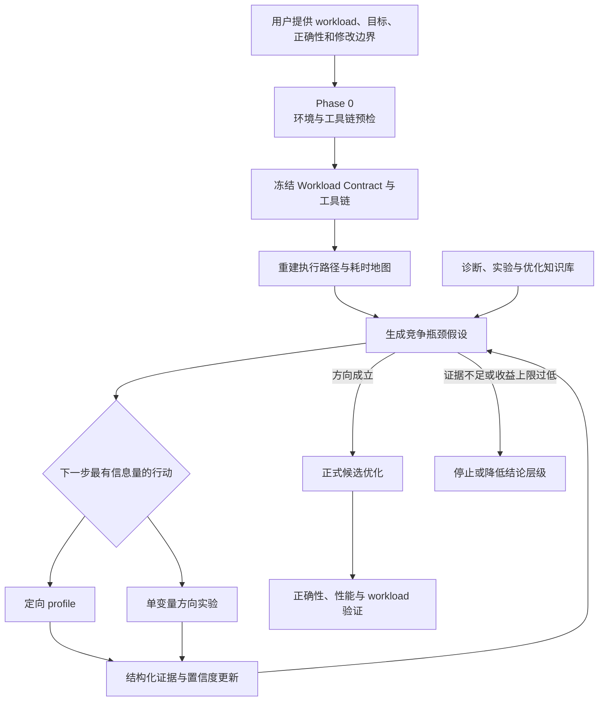

# CUDA Kernel Optimizer 3.1 设计基线

状态：书面设计已确认，进入 Phase 0 实现计划，2026-07-20

## 1. 版本目标

3.1 的首要目标是更快找到有效优化方向。

这里的“更快”不是生成更多建议，也不是用更多实验碰运气，而是减少从接收真实
workload 到确认正确方向所消耗的总时间、GPU 时间、profile 轮次和无效修改。

3.1 在 3.0 确定性 Controller、Workload Contract、证据账本、稳定性校准和晋级门禁
之上，增加一个分析、知识和方向实验一体化的主动诊断引擎：

- 分析引擎重建完整执行路径，形成竞争瓶颈假设；
- 诊断知识库连接现象、根因、指标、反例、实验和优化方法；
- 行动规划器在补充 profile 与方向实验之间选择单位成本信息量最高的行动；
- 方向实验用可回滚的单变量干预建立因果关系；
- 正式候选仍由正确性、统计证据和真实 workload 决定是否保留。

3.1 不承诺固定加速倍数。它必须证明：在相同 workload、环境、模型和预算下，比
3.0 更快确认正确方向，或者更快给出证据充分的停止结论。

## 2. 有效方向的分级

方向结论分为三级，不能混用：

1. **值得验证**：完整 workload 的时间占比、理论上限和适用条件支持继续收集证据。
2. **方向成立**：profile 与最小方向实验共同支持根因，主要竞争解释已被排除，结果
   可重复且符合预期。
3. **优化成功**：正式候选通过正确性、约束、配对统计和完整 workload 回归。

3.1 优先缩短达到第二级的时间。第二级不拥有代码晋级权；只有第三级可以保留正式
修改并形成 workload 结论。

## 3. 总体流程

每一轮只允许一个清楚的问题：要区分哪些假设，什么结果会改变下一步决策。固定清单
式的全量 profile 和无假设的参数搜索不进入正式诊断预算。

## 4. Phase 0：环境与工具链预检

正式 profile 和候选迭代之前必须完成预检。当前 3.0 的 `readiness.py` 与
`check_env.py` 只能报告部分缺口，不能证明工具真实可用，也不是 Controller 门禁。

### 4.1 依赖推导

根据 workload、实现语言、目标环境和结论层级生成依赖矩阵。依赖使用两个正交维度：

- 必要性：`required` 缺少时不能支持目标结论，`diagnostic` 缺少时降低定位能力，
  `optional` 只在对应假设出现时启用；
- 控制范围：`project`、`isolated_environment` 或 `host`。`host` 需要宿主机权限，只能
  建议处理，不能因为它通常是诊断工具就把它误判为非必要。

覆盖 Python、Torch、Triton、CUDA runtime/toolkit、CUTLASS/CuTe DSL、编译器、CMake、
Ninja、Nsys、NCU、compute-sanitizer、`ptxas`、`cuobjdump`、`nvdisasm`、框架 benchmark
和 workload 自身依赖。清单必须按任务裁剪，不能默认安装全部工具。

### 4.2 安装边界

用户在合同中授权后，可以自动安装：

- 项目独立 venv、Conda 环境或容器中的依赖；
- 项目目录下固定版本的 headers、CUTLASS 和辅助二进制；
- 用户批准的隔离环境中的编译、profiling 与 benchmark 工具；
- 项目内 workload adapter、reference 和 benchmark scaffold。

默认只给建议，不自动修改：

- GPU 驱动、kernel module 和系统 CUDA；
- NCU counter 权限；
- GPU 频率、功耗、持久化模式；
- Docker daemon、系统服务和安全策略；
- 宿主机全局包。

所有下载来源、版本、摘要、安装位置和授权范围在安装前写入计划。正式优化开始后，
工具链冻结，不能为追求结果静默升级。

### 4.3 能力 probe

命令存在不等于能力可用。每项正式能力必须运行真实 smoke test：

| 能力 | 准入证据 |
|---|---|
| 编译 | 针对目标架构编译最小真实代码 |
| GPU 执行 | 启动 kernel、同步并验证输出 |
| Nsys | 对最小 workload 生成并解析 trace |
| NCU | 对目标 kernel 实际采集 counter；`--query-metrics` 不算 |
| Sanitizer | 对最小 kernel 完成一次检查 |
| SASS | 从本次编译产物提取并解析 SASS |
| Benchmark | 完成 warmup、重复测量和噪声校准 |
| Workload | 用真实代表输入通过正确性与 KPI 采集 |
| 回滚 | 修改、恢复并复核源码 identity |

readiness 使用独立的 capability probe 协议，不复用正式 workload diagnosis probe。
基础能力先用限定时间的最小目标程序验证；只有基础能力成立后，才初始化真实 workload
并执行 workload smoke。任务没有要求的能力不运行，例如不需要 NCU 结论时不能为了
“检查完整”采集 counter。

每份 readiness 证据必须绑定实际命令与版本、容器或隔离环境、执行用户、GPU identity、
GPU 可见性和权限状态。合同为每项能力定义最大可复用时长；在依赖该能力的高成本动作前，
只要证据过期，就重跑对应 probe。3.1 v1 不尝试推断隐式依赖：上述任一环境身份发生变化时，
全部 readiness 证据失效并重新运行所需 probe。身份未变且证据仍有效时直接复用，不做无条件
周期检查。最小 probe 只证明工具能力可用，真实 workload 兼容性仍由后续 workload smoke
负责。

预检结果分为 `ready`、`auto_fixable`、`user_action_required`、`degraded` 和 `blocked`。
存在未处理的 `required` 项时，Controller 不能进入正式诊断。

### 4.4 独立预算

环境准备使用 `readiness_budget`，profile、方向实验和候选使用
`optimization_budget`。准备阶段有明确时间和修复次数上限。超过上限后只能使用已验证
替代路径、降低结论层级、给出用户操作建议或停止；不能在正式候选轮次中继续开发基础
工具，也不能为了缺少 profiler 自行重写一个 profiler。

## 5. 分析引擎

### 5.1 完整执行路径

第一次采集优先回答瓶颈在哪一层，而不是直接研究某个 kernel。输出必须包含：

- CPU、GPU、框架、传输、通信、I/O、同步和空闲时间；
- hot path、主要 kernel、调用关系和累计时间占比；
- shape、batch、并发、输入分布和动态执行分支；
- 数据来源、采集窗口、环境身份和证据新鲜度；
- 当前能支持的结论层级。

输出是结构化执行路径与耗时地图，不是 profiler 截图或日志摘抄。

### 5.2 竞争假设

每个问题维护一个有限假设集。每项假设记录：

- 支持证据；
- 反对证据；
- 易混淆根因；
- 尚缺的区分证据；
- 可解释的置信度；
- 最便宜的下一步 profile 或实验。

假设还必须绑定目标 scope、证据 epoch 和与其他假设的关系：`exclusive`、`depends_on`
或 `coexists_with`。机制性修改、主要 shape 分布变化或瓶颈迁移会开启新 epoch；旧证据
保留用于审计，但不能继续支撑当前方向。混合瓶颈必须拆成可区分但允许共存的假设，
不能强行选出唯一根因。

单一 metric 不能直接成为根因。高置信度结论至少需要两类独立证据，或一类观察证据
加一个单变量方向实验。证据冲突时降低置信度并保留冲突，不选择性忽略。

### 5.3 分级 profile

采集分为：

1. 全局扫描：一次 workload timeline，确定瓶颈层级和关键路径；
2. 定向诊断：只 profile 累计覆盖主要耗时且可能改变方向判断的目标；
3. 假设补证：只采集能区分剩余竞争解释的 metric。

已有 report 中的 range、action、metric、rule、source 和 SASS 应结构化复用。换一个问题
表述不能成为重新采集相同证据的理由。

每类 profiler 都要记录采集开销和对执行形态的扰动。Nsys timeline、NCU replay 和
未插桩 workload 的结果不能直接互相替代；NCU counter 用于解释目标 kernel，不用其
插桩后的端到端耗时证明 workload 收益。

## 6. 知识库

每项能力拆成三个直接关联的单元：

| 单元 | 内容 |
|---|---|
| Diagnostic Card | 症状、根因、竞争解释、区分 metric、架构与版本边界 |
| Probe Card | 单变量实验、预期结果分支、成本、风险、恢复和结论不足条件 |
| Optimization Card | 正式修改方法、适用范围、正确性风险、验证与停止条件 |

知识条目必须带精确架构、软件版本、来源、复核日期、正向信号、反向信号和所需证据。
知识卡只能生成或排序假设，不能把方向标记为成立，也不能晋级候选。

每条知识还必须声明失效条件和冲突对象。超过复核期限或命中架构、工具链、框架版本等
失效条件时，只能降级为待核线索；冲突条目同时满足适用范围时，必须把冲突暴露为竞争
假设并补采区分证据，不能按录入顺序或单一来源静默胜出。

首批内容围绕真实推理路径建设：

- prefill、decode、GQA/MQA attention；
- paged KV cache append、gather 和 layout；
- RMSNorm、RoPE、activation 与 pointwise 融合；
- FP8、INT8、NVFP4 量化、反量化和 scale 融合；
- GEMM、grouped GEMM 与 MoE dispatch；
- CUDA Graph、launch、同步与框架调度；
- CPU、数据处理、H2D、通信和 I/O。

能力不能只凭文档进入正式库。至少需要一个可重放正向案例和一个“不应使用”的反例。

## 7. 方向实验

方向实验是主动诊断的一部分，不是 profile 的替代品，也不是正式性能成果。

每个实验必须预登记：

- 要区分的竞争假设；
- 唯一允许变化的变量；
- 预计影响的指标与方向；
- 不同结果分别支持或反对什么；
- 正确性和安全边界；
- 最大时间、GPU 和修改预算；
- 恢复办法；
- `PASS`、`KILL`、`INCONCLUSIVE` 的判定。

“单变量”指一次实验只能验证一个预登记的因果问题。若机制天然由多个耦合参数组成，
可以把一组参数声明为一个原子干预，但必须完整记录全部变化，并另设消融来说明是哪一
部分产生作用；不能用“耦合”掩盖无边界搜索。

方向实验优先使用功能受限、可回滚的最小探针。例如预加载输入隔离 CPU 数据处理，
改变一个 launch 参数检查寄存器或 occupancy 假设，或者用临时 CUDA Graph 验证 launch
开销。方向成立不要求排除所有可能原因，但必须排除会实质改变下一步行动、修改范围或停止
决定的竞争解释。探针结果可以确认方向，但不能直接保留生产代码；如果探针 diff 本身适合
生产，可将同一份 diff 重新登记为正式候选，并从头执行正确性、性能、稳定性和证据门禁，
不能沿用探针身份自动晋级。

## 8. 行动规划器

下一步行动可以是补充 profile，也可以是方向实验。规划器比较：

- 区分竞争假设的能力；
- 执行时间与 GPU 成本；
- profiler 开销与环境干扰；
- 正确性和回滚风险；
- 结果能否改变方向排序或停止决定。

优先选择单位成本信息量最高的行动。AI 可以提出行动和解释，Controller 校验工具链、
预算、单变量约束和证据身份。AI 不能修改评分输入、预算和停止条件。
没有历史校准时不生成看似精确的概率。第一版使用显式证据覆盖、反证能力、成本等级和
风险等级排序；只有离线重放证明概率校准有效后，才能用概率或熵作为正式裁决输入。

## 9. 防偏航约束

3.0 的控制边界全部保留，并增加：

- Phase 0 未通过时不开始正式诊断；
- 工具修复不计为优化候选，也不能占用候选轮次；
- 每轮只解决一个预登记的区分问题；
- profile 与实验都进入同一追加证据链；
- baseline、champion 和环境按合同周期重放；
- 无效证据永久隔离，不能进入摘要、知识更新或外部质证；
- 失败机制不能通过改名再次消耗预算；
- 外部检索和外部 AI 只补充假设与反例，本地证据拥有最终裁决权；
- 宿主机优化未经单独授权只给建议。

## 10. 验收指标

主要指标：

- 首个成立方向耗时；
- 首个成立方向消耗的 GPU 时间；
- top-1 根因准确率和 top-3 召回率；
- 置信度校准；
- profile 轮次和重复采集率；
- 方向实验次数、成本和结论不足率；
- 正式修改前淘汰错误方向的比例；
- 错误层级消耗的预算；
- 首选方向产生正式有效候选的概率；
- 最终 workload 指标和正确性违规数。

评测固定 workload、环境、模型、预算和随机种子，对比：

- 无 skill 或随机方向；
- 3.0；
- 3.1 只有分析引擎；
- 3.1 只有方向实验；
- 3.1 完整主动诊断闭环。

这组消融用于证明分析、知识和实验分别贡献了什么，不能只比较最终最好样本。
各项数值门槛不在缺少基线时主观指定。首轮先测量 3.0 的时间、轮次、成本、准确率和
失败分布，再把 3.1 的目标值、允许波动和停止条件冻结到评测合同中；冻结后不能为了
通过发布门槛临时放宽。

固定标杆用于可重复的因果比较；它不能单独证明对未来 workload 仍有效。每个版本另从
未参与规则和门槛制定的新案例中建立滚动留出集，只做前向验证，不用其结果回调当期门槛。
固定标杆和滚动留出集都必须分别报告，避免针对少数已知任务过拟合。

## 11. 首轮真实验证

首个标杆使用另一条 Triton 优化任务中的真实 workload，并在 RTX 5090 上运行。至少
覆盖：

- 一个 kernel 主导的正向案例；
- 一个 CPU、框架、I/O 或 launch 主导的反向案例；
- 一个混合瓶颈案例；
- NCU counter 可用和 `ERR_NVGPUCTRPERM` 降级路径；
- 缺少工具、可自动安装、需用户处理和必须降级四类预检结果；
- 中断恢复、噪声上升和错误方向停止。

发布门槛不是必须取得固定提速，而是 3.1 相比 3.0 在相同预算下可重复地缩短正确方向
确认时间，减少错误方向成本，并保持正确性、安全性和证据完整性不退步。

## 12. 明确不做

- 不把更多 profile 轮次当成更强分析；
- 不做无假设的全量 counter 收集；
- 不在候选轮次中长期修 runner 或自造 profiler；
- 不让知识卡、方向实验或外部 AI 直接晋级代码；
- 不自动修改宿主机驱动、权限、频率、功耗和系统服务；
- 不在没有真实 workload 时声称端到端优化成功；
- 不让运行过程自动改写合同、门禁和知识库正式条目。

## 13. 下一轮迭代顺序

书面设计批准后，下一轮按以下顺序执行：

1. 用最新一手资料和独立外部 AI 对设计做匿名质证，记录采纳与拒绝理由；
2. 在真实 Triton 任务上复现 3.0 的工具准备和方向定位成本，冻结基线；
3. 先用 TDD 实现 Phase 0 环境与工具链预检及 Controller 准入；
4. 实现执行路径、竞争假设和结构化诊断摘要；
5. 建设 Diagnostic、Probe、Optimization 三类关联知识卡；
6. 实现 profile/实验统一行动规划和预算裁决；
7. 在 5090 与真实 workload 上做消融、故障注入和前向测试；
8. 更新中英文文档与 release note，经全量验证后再决定是否发布 3.1。
