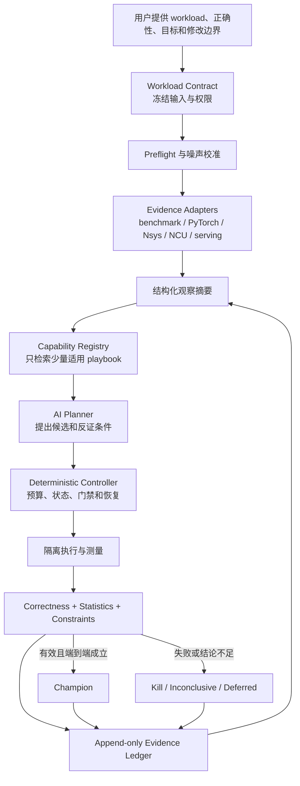
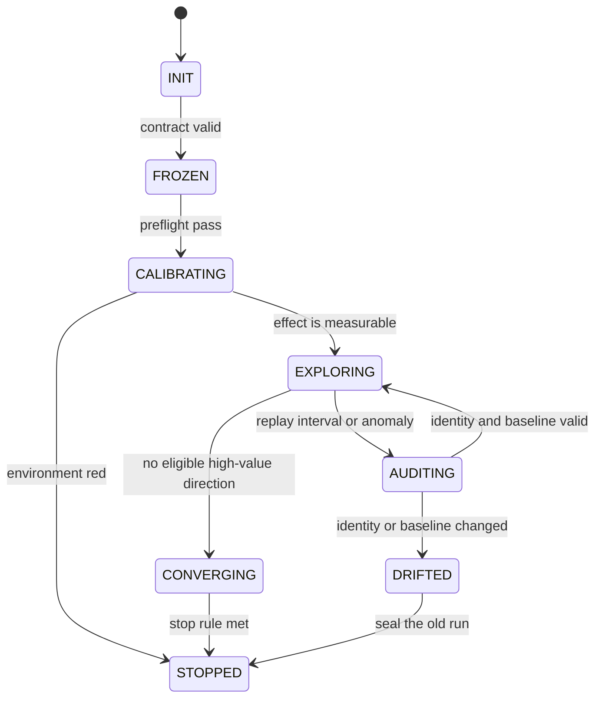

# CUDA Kernel and Workload Optimizer 3.0 设计

状态：开发基线，2026-07-19

## 1. 3.0 要解决什么问题

2.9 已经具备 workload 诊断、kernel 迭代、证据封存、方向准入、知识查询和中断恢复能力。3.0 不再以增加脚本数量为目标，而是把这些能力组织成一个能长期运行、能自我纠偏、能解释每一步为什么值得做的优化系统。

它面向 AI 执行，不要求用户手工照着 README 拼命令。用户提供真实 workload、正确性边界、目标环境和允许修改的范围；AI 负责建立基线、定位瓶颈、提出并验证修改、保留可复查证据。缺少条件时，系统明确指出缺口并协助补齐，但不伪造 workload，也不把静态判断写成优化成果。

3.0 的定义是：

> 一个以真实 workload 为入口、以确定性实验控制器为骨架、以按需加载的 GPU 优化能力库为知识层、以可重放证据为裁决依据的 AI 优化运行时。

目标不是保证任意任务达到固定加速倍数。可验证的目标是：在相同 workload、环境和预算下，比 2.9 更快找到有效方向，更少浪费 GPU 时间，更少产生无效修改，并且在长时间运行、中断、噪声或环境漂移时仍然守住正确性和目标边界。

## 2. 从 kernel-skills 吸收什么

[tensormux/kernel-skills](https://github.com/tensormux/kernel-skills) 的价值不在于知识条目多，而在于把经验拆成可检索、可组合、可单独演进的小能力：每项能力有明确适用范围、操作步骤、反例、验证方法和元数据。3.0 采用这种细粒度组织方式，但不复制它的全文 bundle，也不把 Markdown 证明当成性能证据。

采用：

- 一个能力只解决一类清楚的问题；
- 元数据先参与筛选，正文只在命中后加载；
- 能力带版本、来源、硬件和软件适用范围；
- 操作建议必须附带反证信号和验证办法；
- 能力库、控制器和评测可以独立演进。

补足：

- 能力卡只提出候选，不拥有晋级权；
- 性能结论必须来自用户 workload 上的本地实验；
- 硬件能力按精确架构匹配，不能按 SM 数字大小继承；
- 原始样本、工具报告、候选源码和决策记录都要绑定哈希；
- 要有无能力库、乱序能力库和随机规划器对照，证明系统真正增加了价值。

## 3. 总体结构

职责必须分开：

| 部件 | 可以做什么 | 不可以做什么 |
|---|---|---|
| AI Planner | 阅读结构化观察、选择能力、提出一个可证伪候选 | 改预算、改 workload、改历史记录、直接宣布晋级 |
| Controller | 校验状态迁移、预算、身份、门禁、恢复和停止 | 猜测性能原因、代替 workload 作业务判断 |
| Capability Registry | 提供与信号、架构和工具链相符的做法 | 按历史速度排序后直接执行、跨架构猜测兼容性 |
| Evidence Ledger | 追加事实、绑定来源、支持重放和审计 | 接受覆盖、删除或无来源的性能结论 |
| External Research / AI | 补充候选、指出遗漏和反例 | 接触未授权私有数据、替代本地验证、参与晋级投票 |

## 4. 防止长时间优化跑偏

### 4.1 冻结 Workload Contract

运行开始时生成不可静默修改的合同，至少绑定：

- workload、输入分布和正确性参考；
- 目标指标、方向、单位、聚合方式和允许退化项；
- target source、依赖、编译参数、容器和设备身份；
- 允许修改的项目路径、隔离环境和 `recommend_only` 宿主机策略；
- 预算、并发、停止条件和最大证据陈旧时间；
- 所请求结论层级：kernel、workload 或 serving。

合同、源码、输入和关键环境记录采用规范化摘要和文件哈希双重绑定。任何身份变化都进入不可晋级的 `DRIFTED` 终态。新合同必须创建新的 `run_id` 和账本，并以 `parent_run_id` 指向旧 run；两份合同的候选、预算和 champion 不能混在同一条证据链中。

### 4.2 确定性状态机

每个候选在执行前登记：观察、假设、预计影响的指标、预计成本、杀死条件、所用能力版本和代码修改范围。候选只能得到 `PASS`、`KILL`、`INCONCLUSIVE` 或 `DEFERRED`。测不到小效应时应标为结论不足，不能当成失败，也不能反复重试消耗预算。

以下情况立即停止晋级并封存快照：

- workload、源码、输入、环境或目标身份不符；
- 正确性失败或约束越界；
- 证据账本无法安全追加或哈希链断裂；
- 预算耗尽；
- 非法状态迁移；
- 晋级所依赖的证据已过期；
- 环境处于不可比较状态。

### 4.3 噪声和可测效应

3.0 不写死通用 CV、置信度或提升百分比。校准阶段使用配对 baseline/champion 重放估计当前环境的噪声分布，并结合目标、业务可接受误差和剩余预算计算最小可测效应。环境状态分为：

- `green`：允许新候选；
- `yellow`：暂停新候选，重放基线并缩小结论范围；
- `red`：停止实验，只输出缺口和建议。

宿主机频率、功耗、驱动、计数器权限和服务配置仍然只读检测；未经单独授权只给建议，不自动修改。

### 4.4 允许学习，但不允许改规则

Planner 可以看到已验证的指标变化、失败分类、瓶颈信号、候选谱系和有限日志摘要，这样它能从失败中学习。它默认不读取整段原始日志，也不能修改合同、账本、状态迁移、预算和门禁。原始证据由确定性工具按需解析，避免上下文被日志淹没。

## 5. 能力库

现有 `method_registry.json` 保留为低成本候选索引。3.0 在其上增加 playbook 层，每个 playbook 只在观察信号命中后加载。最小元数据为：

- `id`、`version`、`task`、`layer`、`axes`；
- 精确架构和硬件特性，框架及版本范围；
- 正向信号、反向信号、前置证据；
- 冲突方法、预估上下文成本、风险；
- 验证步骤、停止条件、证据状态；
- 来源、许可、最后复核日期。

首批能力覆盖真实推理工作中最常见且能在 RTX 5090 验证的六类场景：

1. Triton attention / GQA 的形状、布局和 launch 选择；
2. prefill 与 decode 分离验证；
3. RMSNorm 及相邻 pointwise 融合；
4. paged KV cache append / gather；
5. 量化、反量化与缩放融合；
6. kernel 正确性、边界形状和数值稳定性验证。

能力库只保存稳定知识、决策线索和验证办法。版本敏感事实仍需从本机工具或一手文档确认。离线环境可使用带来源和复核日期的快照；过期或不匹配的条目降级为 `unverified`。

## 6. 完整 workload 如何进入 3.0

3.0 必须保留完整 workload，但范围是有界的离线优化：

1. 从真实 workload 找出当前主要耗时层；
2. 在能隔离重放的局部路径上优化；
3. 先过正确性和局部性能门禁；
4. 再回到完整 workload 验证目标指标和副作用；
5. 只有端到端结果成立，才形成 workload 结论。

不在 3.0 自动处理线上非平稳流量、持续改变请求分布或自动修改服务配置。这些需要站点级控制权和更长的安全验证周期。

## 7. 如何证明 3.0 有用

所有比较固定模型、任务、环境和预算，至少包含四组：

| 组别 | 作用 |
|---|---|
| 无 skill / 随机候选 | 判断任务本身和搜索运气能做到多少 |
| 2.9 | 版本升级的直接基线 |
| 3.0 控制框架 + 随机 Planner | 分离确定性实验框架的价值 |
| 3.0 完整版 | 判断能力库和 AI 规划是否带来增量 |

评测记录必须绑定模型及版本、prompt 摘要、skill 摘要、Workload Contract
摘要、环境摘要、随机种子和重复编号。事件名不能由执行模型自行填写；评测
oracle 只能从已校验的控制账本和带哈希的原始产物派生事件与成本。除单项故障
外，还要用虚拟时钟完成一次组合长跑：依次注入噪声、中断、pending 写入、
workload 漂移、证据过期和重复机制提案，验证旧 run 终止、预算不双花、旧证据
不晋级、失败机制不能靠改名重试。

主要指标：正确性违规数、首次有效假设时间、每 GPU 小时有效候选数、端到端指标变化、无效建议率、上下文和实验成本、中断恢复成功率、身份或状态违规数。

发布前必须通过三项反证实验：

1. **Planner 反证**：完整 3.0 若不优于随机 Planner，缩小 AI Planner 的职责，而不是宣称成功。
2. **能力库反证**：真实元数据若不优于打乱信号和适用范围的能力库，说明检索设计没有提供有效知识。
3. **错误瓶颈反证**：在故意把主要瓶颈放到 CPU、I/O 或框架调度的 workload 中，系统不能把大部分预算浪费在 kernel 微调上。

阈值不在实现前拍脑袋决定。先复跑 2.9 得到噪声、成功率和成本分布，再冻结 3.0 的发布门槛。最低要求是安全性和正确性不退步，并在至少一个主要效率或效果指标上有可重复改善。

## 8. 外部检索和多模型质证

它们是可选增强，不是运行依赖，也没有晋级权。适合用于架构不确定、知识可能过期、连续候选失败或重大方向选择。默认流程是：先独立回答，再匿名交叉质疑，最后由本地证据裁决。网络失败时完整回退到离线能力库。

本设计已接受 GLM、DeepSeek、Kimi 两轮质证。共同意见是：长期循环必须由确定性状态机控制，AI 只提出候选；合同、预算、账本和晋级门禁不能交给模型；要先估计噪声和可测效应；完整 workload 应负责定位瓶颈并在局部优化后复验。未采用的建议包括固定通用阈值、自动修改宿主机、只做单 kernel MVP 和让外部模型参与投票晋级。

## 9. 3.0 明确不做什么

- 不承诺固定加速倍数；
- 不用 capability 数量代替优化效果；
- 不让 AI 或外部模型覆盖实验事实；
- 不自动进行线上流量自适应；
- 不从一个 SM 架构推断另一个架构必然可用；
- 不在没有用户 workload 时虚构端到端结论；
- 不未经授权修改驱动、频率、功耗、计数器权限或服务配置。

## 10. 主要依据

- [Agent Skills specification](https://agentskills.io/specification)：渐进式加载、脚本、参考资料和元数据组织。
- [Nsight Compute Python Report Interface](https://docs.nvidia.com/nsight-compute/PythonReportInterface/index.html)：离线读取并结构化 `.ncu-rep`。
- [Nsight Compute documentation](https://docs.nvidia.com/nsight-compute/NsightCompute/index.html)：报告合并、规则和分析工作流。
- [Nsight Systems User Guide](https://docs.nvidia.com/nsight-systems/UserGuide/index.html)：跨 CPU、GPU、通信和运行时的时间线证据。
- [PyTorch Profiler](https://docs.pytorch.org/docs/stable/profiler.html)：框架级事件和 execution trace。
- [vLLM bench serve](https://docs.vllm.ai/en/stable/cli/bench/serve/) 与 [TensorRT-LLM Performance Tuning Guide](https://nvidia.github.io/TensorRT-LLM/performance/performance-tuning-guide/index.html)：完整推理 workload 指标和调优边界。
- [tensormux/kernel-skills](https://github.com/tensormux/kernel-skills/tree/7b7337a)：细粒度能力组织的参考实现；引用内容受其 MIT License 约束。
