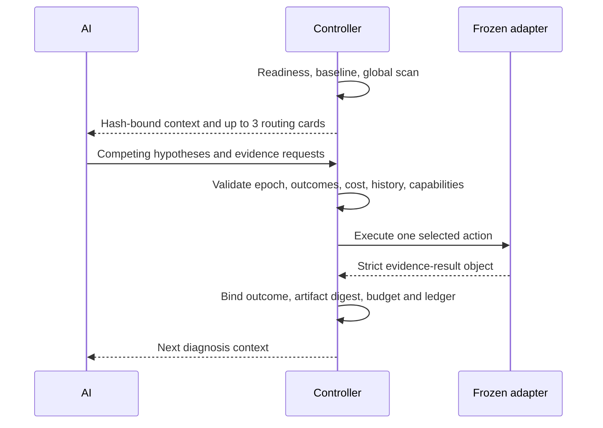

# Workload Controller example

This page shows what the AI and Controller exchange during a V3.1 workload run.
It is not a command list for the user. The user supplies the runnable workload,
reference, target environment, objective, constraints, and allowed project paths;
the AI prepares and operates the contracts.

## What is frozen

The AI creates a `control-v2` manifest that binds:

- the user-provided workload and baseline candidate;
- the readiness and active-diagnosis contracts;
- `quick`, `balanced`, or `thorough` budget (`balanced` by default);
- project mutation roots and an isolated environment root;
- `host_policy: recommend_only`;
- the global workload probes used to build the first diagnosis context.

The active-diagnosis contract separately freezes each user-owned evidence adapter,
its SHA-256 digest, argv, timeout, and Controller action ID. A claimed capability in
that file is not trusted: current readiness results decide what can actually run.

## The active diagnosis exchange

An evidence request states the question, target hypotheses, exclusive pairs, and
the support/opposition effect of every possible outcome. The model does not assign
cost, risk, perturbation, or an information-gain score. The Controller obtains those
facts from its catalog and selects deterministically.

The adapter writes one `cuda-optimizer/evidence-result-v1` object. An `observed`
result must name one preregistered outcome; non-observed results use a null outcome.
The Controller binds the selected outcome to the evidence catalog, so the next model
round cannot reinterpret opposing evidence as support.

## Resume and failure behavior

The Controller serializes active-diagnosis mutations per run. A repeated resume after
completion returns the current state and does not execute the adapter again. If an
intent exists without a completion marker, the run enters `manual_recovery`; partial
files are kept only for investigation and never enter the evidence catalog. Recovery
starts a child or new run rather than accepting or replaying that partial result.

Equivalent request signatures and non-repeatable action IDs persist across rounds.
Tampered result content, artifact digests, ledger entries, source identity, workload
identity, or environment identity fail closed.

## Direction experiments and host changes

A direction experiment may execute in a fresh copy of the declared project. Absolute
argv entries inside the project are remapped to the copy, and the original project
identity must remain unchanged. This protects the frozen experiment from ordinary
project edits; it is not containment for untrusted or malicious code. Adapters run with
the current user's OS permissions and require the same trust as other local tooling.

Drivers, GPU counter permissions, clocks, power, services, container runtime, and
other host settings are never changed by this Controller. They are reported as user
actions with supporting evidence.

## What counts as a result

Active diagnosis can decide that evidence is sufficient to try a bounded project
change. It does not prove that the change is faster. Promotion still requires the
frozen correctness checks, paired workload measurements, declared constraints, and
evidence-integrity gates. Without a user-provided representative workload, the result
stops at environment preparation or a bounded diagnostic hypothesis.
